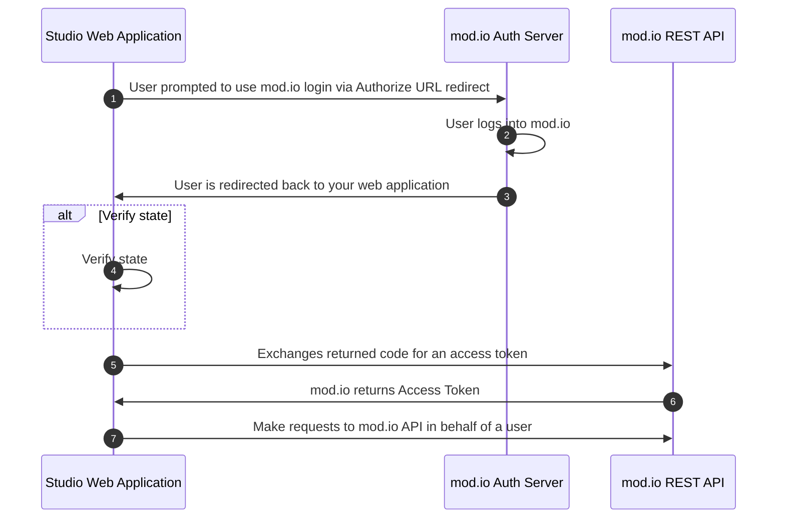

# Overview

mod.io offers the ability to log players into your web application with their mod.io account, enabling you to craft rich user experiences for mod.io players from your studio's portal.

_Sign in with mod.io_ is facilitated via the traditional [OAuth 2.0 Authorization Code flow](https://openid.net/specs/openid-connect-core-1_0.html), which you have likely experienced via other platforms where you are redirected to the identity provider (in this case, mod.io) and then once the login is confirmed, we redirect the users browser back to your domain to log the user into your application.

## Glossary

- **Client Credentials**: The OAuth Client ID and secret generated by your identity provider for mod.io.
- **Authorize URL**: The URL that is associated with the _Sign in with mod.io_ button on your website.
- **Token URL**: The endpoint that your secure server will call to exchange a `code` for a mod.io access token.

## Prerequisites

To use mod.io as an identity provider on your website, you must:

- Have a game registered on mod.io.
- Host a web application that mod.io can redirect to upon successful login, over TLS (https).

## Authentication Process



1. The user is redirected to the Authorize URL that your web application generates, how you display this to the user and initiate this process is up to you.
2. mod.io processes the login request.
3. Upon successful login, the user is redirected back to `redirect_uri` supplied in the [Authorize URL](#step-1-prompting-users-to-login) request.
4. If your web application supplied the `state` parameter, you must verify the returned value is the value you supplied.
5. Your web application securely exchanges the returned `code` for an access token via the [Token URL endpoint](#step-2-redeem-access-token).
6. mod.io API returns an access token, as well as a [refresh token](#step-4-using-refresh-tokens) for the user.
7. Your web application can now make [API calls](#step-3-call-protected-apis) on behalf of the user to the mod.io API.

¹ _Given the Token URL endpoint requires the Client Secret as a request parameter, this should imply this call should only be made securely where the secret cannot be exposed._

## Configuration

### Setting up your OAuth Application on the mod.io dashboard

You can obtain your OAuth Credentials for _Sign in with mod.io_ via the following steps.

1. Navigate to your game's admin dashboard on mod.io.
2. Under _General Settings_, click _OAuth applications_ on the left menu.
3. Grab the Client ID and the Client Secret, which will be required when calling our API's further on in this guide.

### Configuring your redirect URI's

Upon a successful login, mod.io will only ever redirect to a registered `redirect_uri` with a maximum of 20 supported. Multiple redirect URI's can be helpful when you have multiple environments for your website such as testing, staging, production, etc.

## Branding Guidelines

When it comes to prompting the user to log into mod.io, we do not currently have a strict opinion on how you should display mod.io branding providing your implementation is inline with our official [brand guidelines](https://drive.google.com/file/d/1wadueOIuHAZZit0vc4h-IC8ykYgcvyw9/view?usp=drive_link).

## Step 1. Prompting users to login

To begin the login process, your web application will need to craft the Authorize URL that you forward the user to upon the user showing intent to login to your application via mod.io.

#### Request

```
GET https://mod.io/authorize
    ?client_id={your-oauth-client-id}
    &grant_type=authorization_code
    &response_type=code
    &scope={registered-scopes}
    &redirect_uri={your-registered-redirect_uri}
    &state=c3306a41-b7e4-412f-b78e-7477c79b60b5
```

##### Request Parameters

Parameter|Type|Required|Description
---|---|---|---|
client_id|integer|true|The OAuth Client ID for your game.
grant_type|string|true|OAuth grant type. Must be `authorization_code`.
response_type|string|true|OAuth response type. Must be `code`.
scope|string|true|Space-separated scopes you want to request access to. Currently only `read` and `write` is supported. To use both provide value `read write`
redirect_uri|string|true|The URL to your server which mod.io will redirect after login. This value must be a one of the redirect URL's configured in your game admin portal.
state|string|false|A random string you supply and validate upon redirection to your backend service to ensure the value is identical to prevent [CSRF attacks](https://en.wikipedia.org/wiki/Cross-site_request_forgery). You should store this value in a session cookie or some other ephemeral storage solution for comparison upon redirect. Optional but highly recommended.

#### Response (Redirect)

Unlike traditional REST API request / responses, mod.io will _redirect_ the user to your `redirect_uri` defined in the request, with the following Query Parameters appended to the URL. Assuming for demonstrative purposes that the redirect_uri is `https://your-studio-website.com/oauth/callback`, then upon login, irrespective of being successful or not mod.io will redirect the user to:

```
https://your-studio-website.com/oauth/callback?code=def5020077deb4eafe6fb6743b1fd6857ce22112d3400e6cc684633f8c9904faae1a83c23b&state=T6KQGIXWrHXxFDfyp5Hh
```

#### Response Schema (Query Parameters)
Name|Type|Description
---|---|---
code|string|The authorization code to exchange for an access token. Valid for five minutes.
state|string|Optional state parameter to inspect against to prevent CSFR attacks.

#### Verify state parameter (optional)

Upon the redirect, if you included the `state` parameter you should compare the state that you is stored in your website session to ensure it is identical to the state returned. In the event that the value of the `state` parameter is not identical to the value stored on your web server should reject the request.

## Step 2. Redeem Access Token

After successfully obtaining a `code` from the mod.io authentication server, your secure backend is now able to redeem an access token by exchanging the code.

#### Request

`POST https://{your-game-id}.modapi.io/v1/oauth/token`

| Parameter     | Type    | Required | Description                                                                                                  |
| ------------- | ------- | -------- | ------------------------------------------------------------------------------------------------------------ |
| client_id     | integer | true     | Client ID issued to your game.                                                                               |
| client_secret | string  | true     | Client Secret issued to your game. This should be secure on a backend server and never displayed to users.   |
| grant_type    | string  | true     | Must be `authorization_code`.                                                                                |
| code          | string  | true     | The code returned to your registered redirect URI.
| redirect_uri  | string  | true     | The `redirect_uri` registered with your application. This must be the same `redirect_uri` used in Step 1 when logging in via mod.io

```
POST https://{your-game-id}.modapi.io/v1/oauth/token
Content-Type: application/x-www-form-urlencoded
Accept: application/json

client_id=12743894323&client_secret=Uq8jI5vWHoX0BBKDFDeaiYOVjofITG19&grant_type=authorization_code&code=def5020077deb4eafe6fb6743b1fd6857ce22112d3400e6cc684633f8c9904faae1a83c23b&redirect_uri=https://your-studio-website.com/oauth/callback
```
:::warning
The above request of redeeming a code for an access token **must** be made from a secure server and not a frontend framework or single-page application (SPA) where the `client_secret` would be exposed to the browser. You must always keep your OAuth secret safe, and if in the unfortunate event that it is exposed you should immediately rotate the secret via the same dashboard you generated it.
:::

#### Response

```json
{
  "token_type": "Bearer",
  "expires_in": "2592000",
  "access_token": "eyJlbmMiOiJBMTI4Q0JDLUhTMjU2IiwiYWxnIjoiUlNBLU9BRVAiLCJjdHkiOi....",
  "refresh_token": "eyJlbmMiOiJBMTI4Q0JDLUhTMjU2IiwiYWxnIjoiUlNBLU9BRVAiLCJjdHkiOi...."
}
```
##### Response Schema

| Name         | Type   | Description                                                                                                                                       |
| ------------ | ------ | ------------------------------------------------------------------------------------------------------------------------------------------------- |
| token_type   | string | Token type, always `Bearer`.                                                                                                                      |
| expires_in   | int    | Seconds until the supplied `access_token` expires which is fixed at `2592000` seconds (approx 1 month).                                           |
| access_token | string | The user's access token, to be used for calling mod.io API's.                                                                                     |
| refresh_token | string | The refresh token that can be exchanged via the Exchange Refresh Token endpoint for a new access token. Fixed at 7776000 seconds (approx 3 months). See [Refresh Tokens](#step-4-using-refresh-tokens) for information on using refresh tokens. |

## Step 3. Call protected API's

Finally, once you have a valid access token returned from the Token URL endpoint above, it can then be used to make calls to mod.io's API on behalf of the user. For more details on authenticating requests, and the endpoints available, please see our [REST API Reference](http://docs.mod.io/restapiref/) section.

## Step 4. Using Refresh Tokens

Returned with the access token is a refresh token, which can be exchanged for an access token at a later date. Refresh tokens can be convenient as they effectively enable your web application to maintain long-lived token access for a user in a frictionless manner as the user is not required to re-authenticate with mod.io. To exchange a refresh token for another access token, refer to the request details below.

#### Request

`POST https://{your-game-id}.modapi.io/v1/oauth/token/refresh`

| Parameter     | Type    | Required | Description                                                                                                  |
| ------------- | ------- | -------- | ------------------------------------------------------------------------------------------------------------ |
| client_id     | integer | true     | Client ID issued to your game.                                                                               |
| client_secret | string  | true     | Client Secret issued to your game. This should be secure on a backend server and never displayed to users.   |
| grant_type    | string  | true     | Must be `refresh_token`.                                                                                     |
| refresh_token | string  | true     | The refresh token which was returned previously with the access token.                                       |
| redirect_uri  | string  | true     | The `redirect_uri` registered with your application. This must be the same `redirect_uri` used in Step 1 when logging in via mod.io |

```
POST https://{your-game-id}.modapi.io/v1/oauth/token
Content-Type: application/x-www-form-urlencoded
Accept: application/json

client_id=12743894323&client_secret=Uq8jI5vWHoX0BBKDFDeaiYOVjofITG19&grant_type=refresh_token&refresh_token=eyJlbmMiOiJBMTI4Q0JDLUhTMjU2IiwiYWxnIjoiUlNBLU9BRVAiLCJjdHkiOi&redirect_uri=https://your-studio-website.com/oauth/callback
```
:::warning
The above request of redeeming a code for an access token **must** be made from a secure server and not a frontend framework or single-page application (SPA) where the `client_secret` would be exposed to the browser. You must always keep your OAuth secret safe, and if in the unfortunate event that it is exposed you should immediately rotate the secret via the same dashboard you generated it.
:::

#### Response

```json
{
  "token_type": "Bearer",
  "expires_in": "2592000",
  "access_token": "eyJlbmMiOiJBMTI4Q0JDLUhTMjU2IiwiYWxnIjoiUlNBLU9BRVAiLCJjdHkiOi....",
  "refresh_token": "eyJlbmMiOiJBMTI4Q0JDLUhTMjU2IiwiYWxnIjoiUlNBLU9BRVAiLCJjdHkiOi...."
}
```
##### Response Schema

| Name         | Type   | Description                                                                                                                                       |
| ------------ | ------ | ------------------------------------------------------------------------------------------------------------------------------------------------- |
| token_type   | string | Token type, always `Bearer`.                                                                                                                      |
| expires_in   | int    | Seconds until the supplied `access_token` expires which is fixed at `2592000` seconds (approx 1 month).                                           |
| access_token | string | The user's access token, to be used for calling mod.io API's.                                                                                     |
| refresh_token | string | The refresh token that can be exchanged via the Exchange Refresh Token endpoint for a new access token. Fixed at 7776000 seconds (approx 3 months). |

## Handling Failures

mod.io supports the [OAuth 2.0 Standard (RFC 6749)](https://datatracker.ietf.org/doc/html/rfc6749), which has [error handling](https://datatracker.ietf.org/doc/html/rfc6749#section-5.2) encapsulated into the standard. It is recommended you leverage a supported OAuth 2.0 library that handles the error parsing for you. If you are not using a library, your web application should expect in the event of failure, a `error` and `error_description` query parameter set is returned with context of why the request failed.

#### Request

```
GET https://mod.io/authorize
    ?client_id={your-oauth-client-id}
    &grant_type=authorization_code
    &response_type=code
    &scope={registered-scopes}
    &redirect_uri={your-registered-redirect_uri}
    &state=c3306a41-b7e4-412f-b78e-7477c79b60b5
```

#### Response

```
HTTP 302 Found
Location: https://your-studio-website.com/oauth/callback?error=invalid_grant&error_description=Unsupported+grant_type
```

#### Possible Errors

| Parameter     | Description                                                                                                  |
| ------------- | ------------------------------------------------------------------------------------------------------------ |
| `invalid_request` | The request is missing a required parameter, such as `grant_type`.                                       |
| `invalid_client` | The Client ID, Client Secret, or both are incorrect or invalid.                                           |
| `invalid_grant`   | The provided grant or refresh token is invalid, expired or revoked.                                      |
| `unauthorized_client` | Your OAuth application cannot use this grant type.                                                   |
| `unsupported_grant_type`  | The requested grant type is not supported.                                                       |
| `invalid_scope` | The requested scope is either invalid, unknown or malformed.                                               |

## Recommendations

- You should always pass a state parameter in the [Authorize URL](#step-1-prompting-users-to-login) endpoint and whilst its not required, it is strongly recommended.
- Your web application should utilize the [refresh token](#step-4-using-refresh-tokens) returned with access tokens to enable your users to access mod.io functionality over a longer time period without being prompted to re-authenticate due to an expired mod.io token.

## References

- [OAuth 2.0 Standard (RFC 6749](https://datatracker.ietf.org/doc/html/rfc6749) - The standard used by _Sign in with mod.io_.
- [OAuth 2.0 Authorization Code Flow (RFC 6749)](https://datatracker.ietf.org/doc/html/rfc6749#section-4.1) - Specification, specific to the Authorization Code flow.