# Setting up Cloud Cooking

To onboard to cloud cooking, you need start with preparing your game and editor tooling to work with the mod.io infrastructure and cloud cooking process. This differs per engine, and we recommend performing these steps and locally validating your engine before configuring cloud cooking on mod.io.

Once Cloud Cooking has been enabled for your game, you can begin the onboarding process. To begin the onboarding process, navigate to your Game Admin page and select "Cloud Cooking" under General Settings. From here, click Enable Cloud Cooking - this will begin the process of provisioning the infrastructure.

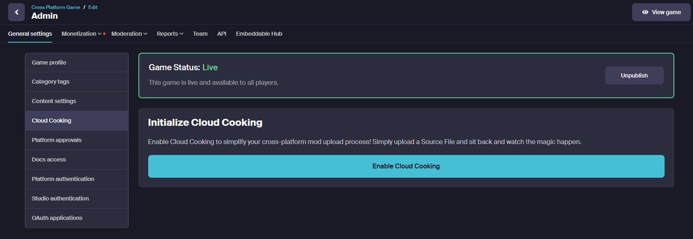

:::note
Depending on your billing agreement with mod.io, you may begin to incur monthly costs as soon as this infrastructure is provisioned.
:::

Provisioning the infrastructure takes a little bit of time. You can check back to this page later for the next step in the process, which is to upload your build.

## Uploading your build

Once infrastructure has been provisioned, you will be presented with a prompt to upload your build to Azure Storage. This data is used to provision the virtual machine images to run the cook. What you need to provide to mod.io depends on what engine you are using - follow the appropriate game preparation guides for how to prepare your build for this step. The SAS Token provided in this step allows you to connect to the Azure Storage Container to provide your build.

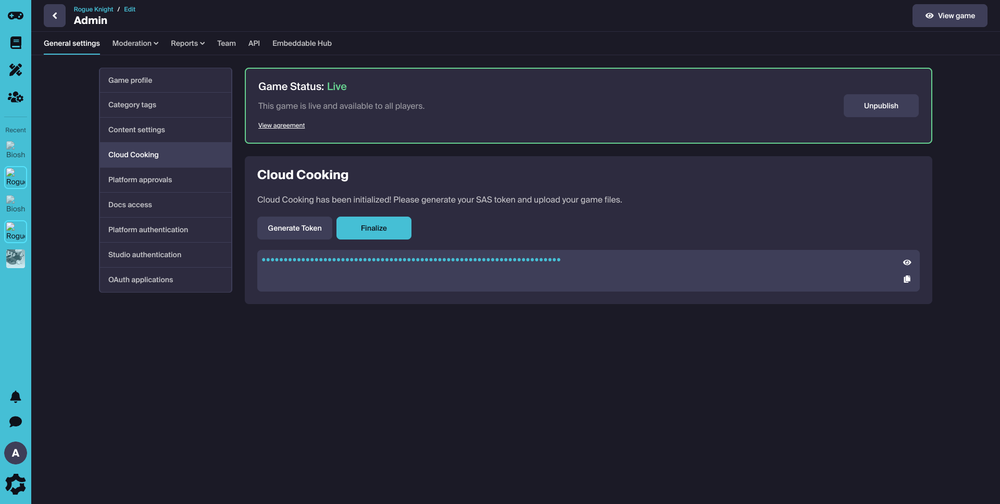

Start by downloading and installing [Azure Storage Explorer](https://azure.microsoft.com/en-us/products/storage/storage-explorer#Download-4). Once you have installed Azure Storage Explorer, select Attach to Resource to connect to your container.

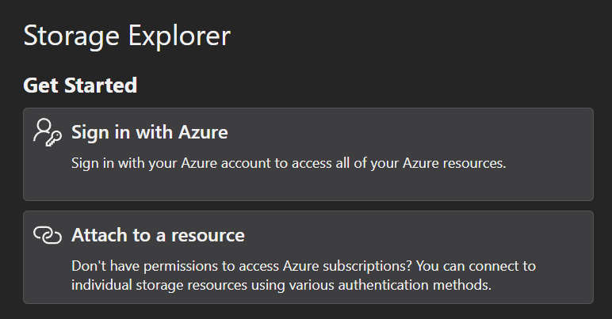 

The resource you want to attach to is a Blob Container or Directory.

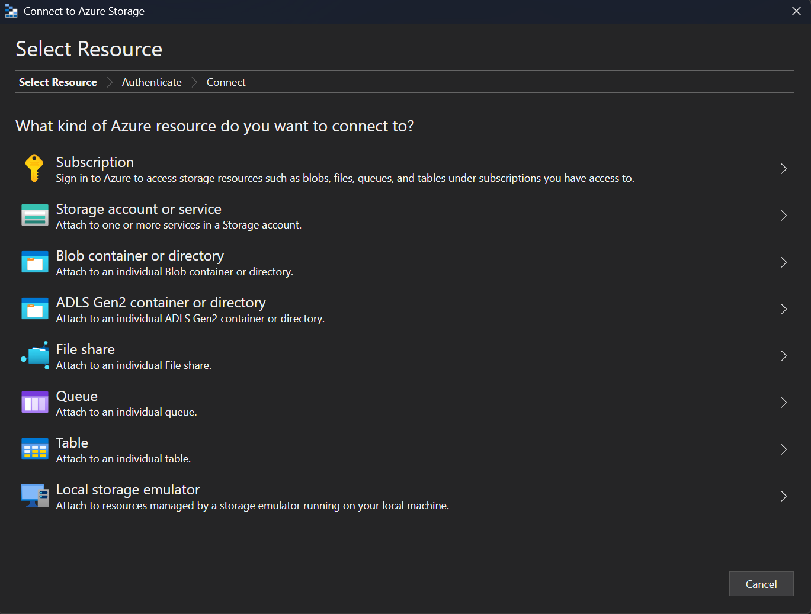

Select the option to connect using a SAS.

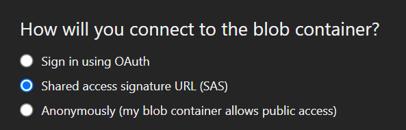

Complete the setup by entering the SAS from your Cloud Cooking page.

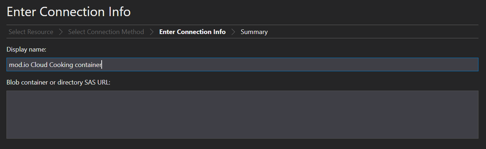

:::note
The generated SAS token is valid for 7 days. Treat this SAS like a secret.
:::

Once you have connected, you can upload your build to the available cloudcooking container as detailed in the Preparing Your Game section.

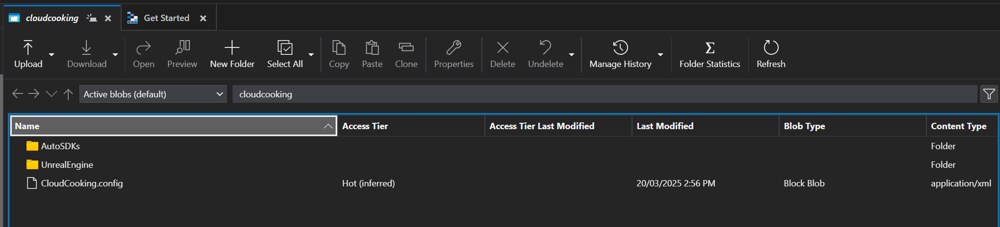

Once you have uploaded your build, you can Finalize this step and mod.io will generate a virtual machine image for the cloud cooking build agents. This can take some time, particularly if your build is large. You can return to the configuration page to verify once the imaging and provisioning process is complete and cloud cooking is available for use.

## Configuring Cloud Cooking Platforms

Once the provisioning process has been completed, your game is now ready to accept source files from your creators. To configure which platforms can be produced by cloud cooking, navigate to your Game Admin page > General Settings > Platform Approvals. 

Any platform which is Locked is available for creators to submit a file to for cloud cooking. Locked platforms cannot have content uploaded to them as part of the normal file upload flow. 

As an example, the following configuration would allow content creators to upload their own files for Windows, but require Playstation 4 and Playstation 5 to go through the cloud cooking process.

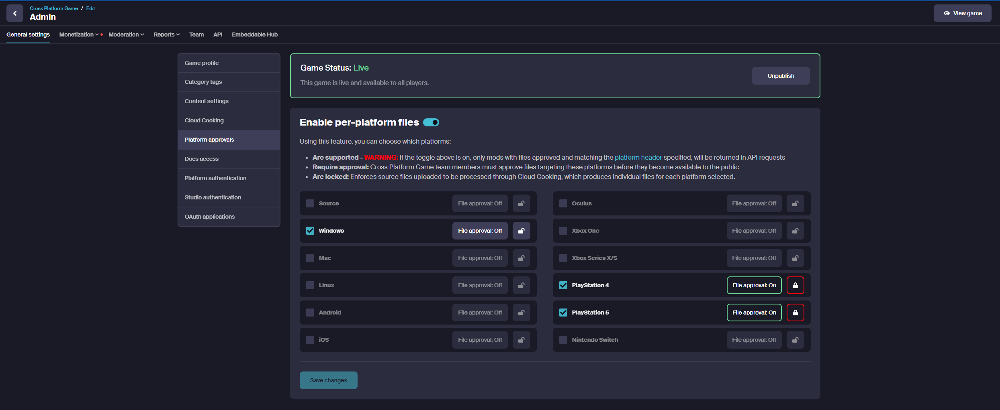

### Source File Upload

Once you have enabled Cloud Cooking and locked the target platforms, content creators will be able to add Source Files targeting those platforms in their mod's File Management page.  

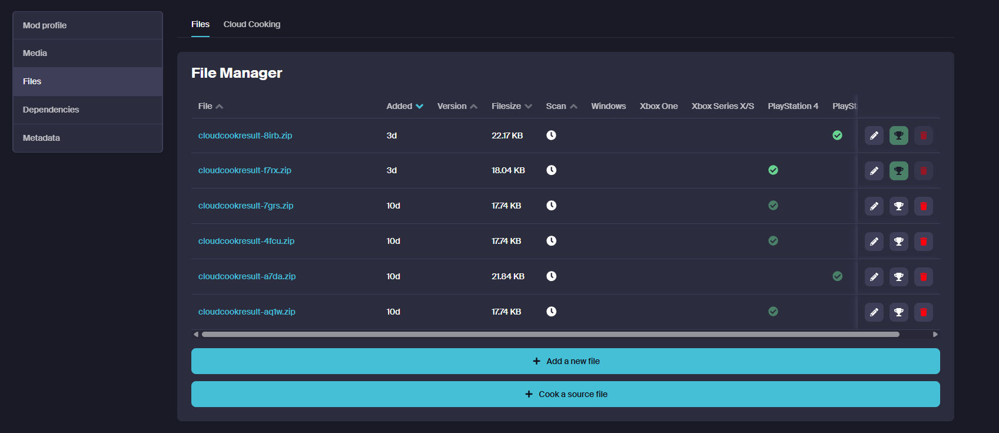

When the creator chooses to upload a source file, they are prompted with the standard File Upload flow, and all Locked platforms (the platforms intended to be targets for Cloud Cooking) ade made available for selection. Any details filled in by the creator are copied to the output platform modfile as part of the cloud cooking process.

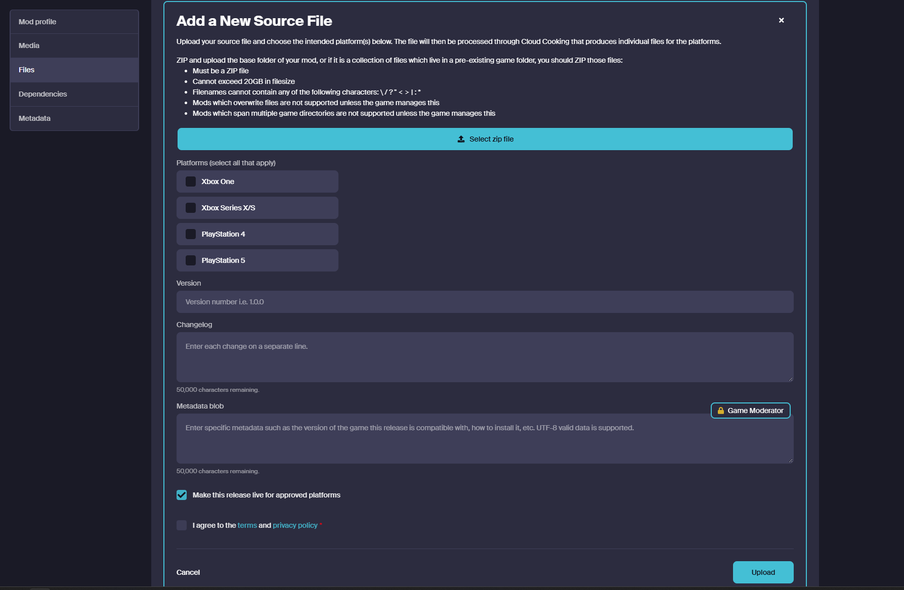

:::note
Platform files that are produced by cloud cooking are subject to the same scanning, approval and moderation workflows as any other file that are uploaded to mod.io.
:::

### Cloud Cooking progress and status reporting

Once a file has been queued for Cloud Cooking, content creators can view the status of their files - whether they are pending cook, in the process of being cooked, and success or failure of the cook process. Once a cook has been completed, full logs are available for viewing in the Details pane for each cook job.

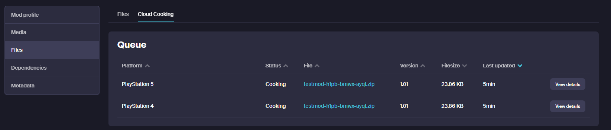