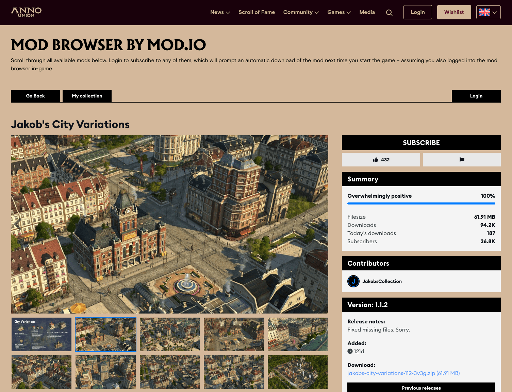

# Overview

The Embeddable Hub enables studios to embed the [mod.io](https://mod.io/g) browser into their own site or in-game. It is highly customizable, offering many style options and control over which features are enabled or disabled.

:::note
The Embeddable Hub is a premium feature. If you are interested in mod.io premium features, please contact developers@mod.io.
:::

## Setup

Once you've gained access to the Embeddable Hub, you'll find the settings in your game's Admin Dashboard. When you navigate to the page, you'll be prompted to set up a hub with a name and some basic styling. After you've saved your changes, your hub will be created and you can now explore the rest of the configurable options as well as preview your hub.

## Demonstration

### On the Web

You can see a live example of the Embeddable Hub running on the [Baldur's Gate 3](https://baldursgate3.game/mods#/) official homepage. It shows the level of customization possible, to match the look and feel of the Baldur's Gate 3 site, and also uses Larian Accounts to sign in.

Another example is [Anno 1800](https://www.anno-union.com/mods/), a Ubisoft game.

### In-game

The Emdeddable Hub can also be used as an in-game UI or overlay for browsing and managing a user's UGC collection. The [Javascript API](../communication#javascript-api) can be used to communicate between the game client and the web UI. The Anno 1800 team also used the Embeddable Hub as their in-game UI, embedding it natively using the [Ultralight](https://ultralig.ht/) plugin, an HTML renderer. You can view the hub in your [browser here](https://anno1800.modhub.io/) and see how it looks in-game in the video below.

<video width="100%" height="auto" controls poster="/video/embeddable_hub_demo_anno_1800_poster.jpg">
  <source src="/video/embeddable_hub_demo_anno_1800.mp4" type="video/mp4" />
</video>
