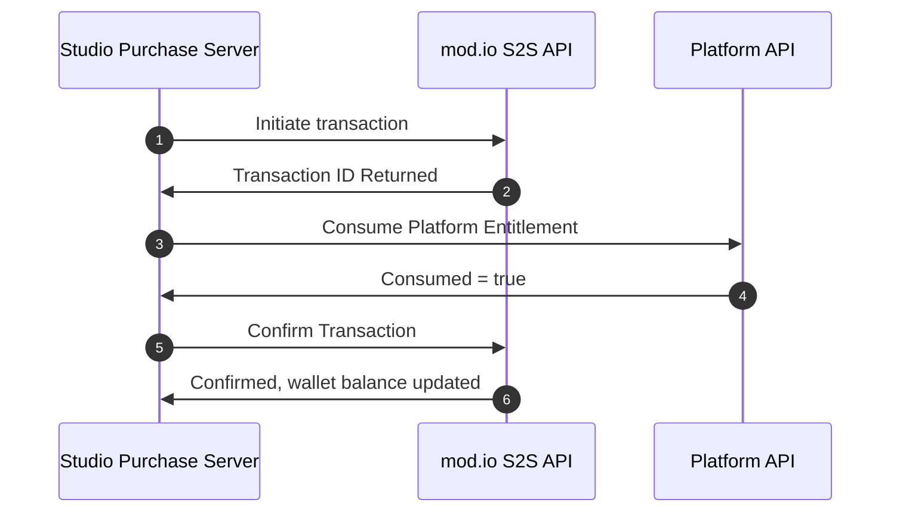

# Studio as Purchase Server

Operating your own a Purchase Server requires a strong understanding of the role you must play in initiating transaction from your secure server. Covered in this section is:

- Making transactions from your purchase server
- Relaying clawback events from your purchase server to mod.io
- Handling failures and edge cases with clawback functionality
- Reading transaction history

## Prerequisites

To operate as a purchase server that communicates transaction date with mod.io, you must have the following steps completed:

- A title registered within mod.io with monetization functionality enabled.
- SKU's registered to your mod.io game profile for the platform the entitlements originate from.
- A secure web server, configured with a [Service Token](/web-services/authentication/s2s/#obtaining-a-service-token) to send service-to-service (S2S) API requests to mod.io
- A [User Delegation Token](/web-services/authentication/s2s/#obtaining-a-user-delegation-token-for-making-requests-on-behalf-of-a-user), enabling the processing of a transaction on behalf of a mod.io user.

## Testing Environment

Please note the test environment domain is slightly different from production and should be called as follows:

```
https://g-{your-game-id}.test.mod.io/v1/s2s/
```

## Architecture Overview

### Transaction Process



1. Studio Purchase Server informs mod.io it is [beginning a transaction](#1-initiating-transaction), providing the mapped SKU the player is purchasing and a User Delegation Token to associate the transaction with a user.
2. mod.io returns the mod.io Transaction ID. This Transaction ID is required in Step 5, and should be saved by the studio for book-keeping.
3. Studio Purchase Server [consumes](#2-consuming-platform-entitlement) the players' entitlement against the platform where the entitlement resides.
4. Platform returns the consumption state after the request.
5. Studio Purchase Server informs mod.io to [finalize the transaction](#3-confirming-transaction), passing in the transaction ID from step 1. Only after this step will mod.io allocate Virtual Currency credits to a user.
6. mod.io confirms the transaction has been finalized, and returns the players' updated wallet balance.

## Implementation

### Idempotent Requests

When making requests to mod.io S2S API's, some endpoints require an Idempotent Key to ensure that your purchase server should be able to safely retry requests without the concern of performing the same operation twice. To understand the benefit of Idempotent requests, consider the following scenario:

1. Your purchase server creates a transaction, passing in an Idempotent Key into the request.
2. mod.io's S2S API successfully receives the request and processes it.
3. A connection error / transient failure occurs before the request is returned to your server.

In this scenario, your purchase server is unaware if the request succeeded of failed. To prevent a second transaction being created, you can safely pass in the same Idempotent Key in the request and the same response will be returned that was in the previous operation.

#### How to set

To set an Idempotent Key in the request, you must set the value as the HTTP header `X-Modio-Idempotent-Key` to be the value that your client can re-send in the event of a transient failure. An example GUID as an Idempotent Key in a request would look like so:

```
X-Modio-Idempotent-Key: e1e186d0-fb4a-4b32-b9de-bbefc65f5b59
```

See below for further examples of an Idempotent Key being incorporated into requests.

#### Recommendations / Things to know

- Idempotent Keys expire after 24 hours.
- Idempotent Keys are scoped to the user context of the request, as defined by the `X-Modio-Delegation-Token` header value passed in the request.
- mod.io recommends the use of GUID's, UUID's or other well known unique identifier standard.
- Your purchase server should store the Idempotent Key in a database in the event you need to re-create the request and get the identical response back for a given operation - whilst being aware of the 24 hour expiry.
- Only POST or PUT requests can support an Idempotent Key.

### 1. Initiating Transaction

This request acts as an indicator of intent, to inform mod.io you are beginning a transaction. This step is necessary for book-keeping in the event a players platform entitlement is consumed, but a purchase server does not finalize the transaction. This is not ideal as the player has then had the entitlement removed from their platform inventory, and they also have not been awarded their mod.io Virtual Currency credits. The purchase server should save the returned _Transaction ID_ returned in this request for your book-keeping.

#### Request

`POST https://g-{your-game-id}.modapi.io/v1/s2s/transactions/intent`

##### Headers

Header|Type|Required|Description
---|---|---|---|
Authorization|string|true|The valid service token created with your OAuth Credentials.
X-Modio-Delegation-Token|string|true|The User Delegation Token requested by your application on behalf of a user.
X-Modio-Idempotent-Key|string|true|A value used to ensure that multiple identical requests are treated as a single request, preventing duplicate operations. Supported characters are alphabetical characters, dashes and underscores. Must validate against the following regex: `/A[a-zA-Z0-9_-]+z/`

##### Body

Parameter|Type|Required|Description
-------|---|---|---|
sku|string|true|The sku ID of the entitlement that will be converted into it's equivalent Virtual Currency Credit amount. This is the identifier that will associate the a transaction with a registered entitlement on mod.io that maps to an eligible Virtual Currency Pack.
portal|string|true|The portal where the sku resides. Valid values are `apple`, `google`, `xboxlive`, `psn` and `steam`.
gateway_uuid|string|false|An optional mapping alpha dash string that can be used to track this transaction. It is recommended to use primary ID of the entitlement as it exists on the processing platform if you have it available.

```
POST https://g-{your-game-id}.modapi.io/v1/s2s/transactions/intent HTTP/1.1
Content-Type: application/x-www-form-urlencoded
Accept: application/json
X-Modio-Idempotent-Key: d720901c-a8ed-42ff-9343-39d4a3e16b18
Authorization: Bearer {service-token}
Content-Type: application/json

sku=Item01&portal=xboxlive&gateway_uuid=1f1ecb47-0074-4092-8eda-f6a65aa2ce32
```

#### Response

```json
{
    "transaction_id": 897258250,
    "gross_amount": 104,
    "net_amount": 104,
    "platform_fee": 24,
    "gateway_fee": 0,
    "transaction_type": "pending",
    "meta": [
        {
            "game_id": 2621,
            "buyer_id": 6990060,
            "game_name": "Rogue Knight",
            "buyer_name": "Gordon",
            "token_name": "Gold",
            "token_pack_id": 1,
            "token_pack_name": "200 Pack"
        }
    ],
    "purchase_date": 1715323164
}
```

##### Response Schema

Name|Type|Description
---|---|---
transaction_id|integer|The transaction id.
gross_amount|integer|The gross amount of the purchase in the lowest denomination of currency.
net_amount|integer|The net amount of the purchase in the lowest denomination of currency.
platform_fee|integer|The platform fee of the purchase in the lowest denomination of currency.
gateway_fee|integer|The gateway fee of the purchase in the lowest denomination of currency.
transaction_type|string|The state of the transaction that was processed. E.g. CANCELLED, CLEARED, FAILED, PAID, PENDING, REFUNDED.
meta|object|The metadata that was given in the transaction.
purchase_date|integer|The time of the purchase.

### 2. Consuming Platform Entitlement

Once you have initiated the transaction your purchase server must now consume the entitlement on the supported platform to reduce its quantity by one _if the entitlement is tracked by the platform_. In the event the platform API does not track the state of entitlements, your server should track in your own database if the Order ID / Line Item ID has been processed previously to guarantee you aren't processing transactions more than once.

Refer to the table below to determine if you can defer entitlement state where the platform tracks entitlement state (consumed, unconsumed, etc) or if you must implement it yourself.

**Platform API** | **Manages Entitlement State?**
|----------|----------
| Xbox Live | Yes
| PlayStation™Network | Yes
| Steam | Yes
| Google Play Store | No
| Apple App Store | No

:::warning
In the event your are unable to consume the entitlement, potentially due to it already being consumed or due to an unforeseen error - you must **not** finalize the transaction and instead abandon continuing until you have successfully consumed the entitlement. 
:::

### 3. Confirming Transaction

Upon successful consumption of the entitlement against the Platforms Entitlement API, you can then finalize the transaction by sending a request to the endpoint listed below. If this request succeeds, the player will then get the Virtual Currency credits amount associated with the SKU in the transaction allocated to their wallet.

#### Request

Create a service-to-service (S2S) transaction commit. This is for performing an external credit transaction. This step finalizes the transaction and will issue creator credits to the user associated to it. A successful request will return a [S2S Pay Object](https://docs.mod.io/restapiref/#s2s-pay-object) object. Requires scope of monetization on token.

`POST https://g-{your-game-id}.modapi.io/v1/s2s/transactions/commit`

##### Headers

Header|Type|Required|Description
---|---|---|---|
Authorization|string|true|The valid service token created with your OAuth Credentials.
X-Modio-Delegation-Token|string|true|The User Delegation Token requested by your application on behalf of a user.
X-Modio-Idempotent-Key|string|true|A value used to ensure that multiple identical requests are treated as a single request, preventing duplicate operations. Supported characters are alphabetical characters, dashes and underscores. Must validate against the following regex: `/A[a-zA-Z0-9_-]+z/`

##### Body

Parameter|Type|Required|Description
---|---|---|---|
transaction_id|integer|true|The ID of the transaction to complete.
clawback_uuid|string|false|An optional mapping alpha dash string that can be used to group this transaction against other transactions.

```
POST https://g-{your-game-id}.modapi.io/v1/s2s/transactions/commit HTTP/1.1
Content-Type: application/x-www-form-urlencoded
Accept: application/json
X-Modio-Idempotent-Key: d720901c-a8ed-42ff-9343-39d4a3e16b18
Authorization: Bearer {service-token}
Content-Type: application/json

transaction_id=897258250&clawback_uuid=b5ce3097-ad5f-4402-8469-57233842d0b4
```

#### Response

```json
{
    "transaction_id": 897258250,
    "gross_amount": 104,
    "net_amount": 104,
    "platform_fee": 24,
    "gateway_fee": 0,
    "transaction_type": "paid",
    "meta": [
        {
            "game_id": 2621,
            "buyer_id": 6990060,
            "game_name": "Rogue Knight",
            "buyer_name": "Gordon",
            "token_name": "Gold",
            "token_pack_id": 1,
            "token_pack_name": "200 Pack"
        }
    ],
    "purchase_date": 1715323164
}
```

## Handling Clawback Events

As part of operating a purchase server, you are responsible for processing clawback events from the first party platforms and relaying them mod.io to protect your in-game economy and mod.io from fraudulent behavior. Reconciliation instructions vary per platform and you should follow any platforms recommended practices for handling their clawback events, and then forward the events to mod.io to potentially action. Some of the common clawback events are:

**Type** |  **Description** | **Should mod.io be notified?**
|----------|----------|----------
| Refund | An platform entitlement that has been refunded by a player. | Only if the entitlement has been consumed and converted into mod.io Virtual Currency.
| Chargeback | A payment provider has reverted a transaction, usually due to cardholder disputes | Only if the entitlement has been consumed and converted into mod.io Virtual Currency.
| Chargeback-Reversal | A previously issued chargeback by a payment provider has since been reversed, acknowledging the transaction was valid | Refer to platform instructions

### Preventing Fraudulent Transactions

As mod.io's marketplace economy uses registered entitlements within a given platform, there is always a risk that refunds and chargebacks can happen against transactions which encapsulated line items which were then in-effect converted into mod.io Virtual Currency. To reconcile or, discourage such behavior, your organization should be aware of the state's a transaction can fall into and when action should be taken.

#### When to notify mod.io of a clawback event

A good baseline to follow, is if the entitlement has been consumed, either by mod.io or your purchase server which resulted in Virtual Currency being allocated to a player, you must [inform mod.io of the clawback event](#sending-clawback-data-to-modio). Read on for examples of common scenarios you will likely encounter to determine if you should or shouldn't forward clawback events to mod.io.

#### Clawback handling for consumed entitlements

Consider an example where the following chain of events occur:

- A player within your title purchases an item, in the form of a consumable entitlement from the platform store.
- Your purchase server converts an eligible entitlement into mod.io Virtual Currency as illustrated in the [transaction process above](#transaction-process), resulting in a player having 100 credits in their mod.io wallet.
- The player spends the 100 credits on our marketplace in exchange for premium UGC, reducing their wallet balance to 0.
- The player disputes the payment with their payment provider, resulting in a chargeback.
- The player has received their funds back for the purchase of the entitlement against the platform store, and still have the premium UGC they purchased with the 100 credits they temporarily possessed.

The scenario described is considered fraudulent behavior as a player could continue to make refund / chargeback claims against either their financial institution or against the platform (Xbox Live, etc) and continue to get funds refunded to them. However critically, mod.io is not aware the funds have been returned and your marketplace is now at a loss as premium UGC has been purchased and distributed, but the funds used in the transaction won't be distributed to your creators - potentially disincentivizing creators from contributing.

For the scenario described above, it is critical to a healthy marketplace within your titles that clawback events are processed by your purchase server, and if eligible, relayed to mod.io for action.

:::warning
Failing to inform mod.io's clawback API of fraudulent behavior you are notified of may result in your title's marketplace functionality being disabled and potentially removed.
:::

#### Clawback handling for yet to be consumed entitlements

Let's step through another scenario, but with an important difference that a refund / chargeback event occurs **prior** to syncing the platform entitlements to mod.io

- A player within your title purchases an item, in the form of a consumable entitlement from the platform store.
- The player disputes the payment with their payment provider, resulting in a chargeback.
- The player has received their money back for the purchase of the entitlement against the platform store however their platform store purchases have not been sync'd to mod.io.

In this event, there is no need to send any clawback events to mod.io as the mapped entitlement was never synced to mod.io there will be no record of the transaction as the player was never issued any Virtual Currency.

### Sending clawback data to mod.io

Once your system has received the clawback events from the platform, you should forward them to mod.io to take any action against already-allocated virtual currency.

#### Request

`POST https://g-{your-game-id}.modapi.io/v1/s2s/transactions/clawback`

Parameter|Type|Required|Description
---|---|---|---|
transaction_id|integer|If `gateway_uuid` is null|The id of the transaction.
gateway_uuid|string|If `transaction_id` is null|The alpha dash string if it was supplied during the [initiate a transaction](#1-initiating-transaction) step.
portal|string|true|The portal the transaction is tied to. Valid values are `apple`, `google`, `xboxlive`, `psn` and `steam`.
refund_reason|string|true|The reason for the refund / transaction reversal.

```
POST https://g-{your-game-id}.modapi.io/v1/s2s/transactions/clawback HTTP/1.1
Content-Type: application/x-www-form-urlencoded
Accept: application/json
Authorization: Bearer {service-token}
Content-Type: application/json

transaction_id=897258250&gateway_uuid=1f1ecb47-0074-4092-8eda-f6a65aa2ce32&portal=xboxlive&reason="Chargeback%20Issued"
```

#### Response

```json
{
    "transaction_id": 897258250,
    "gross_amount": 104,
    "net_amount": 104,
    "platform_fee": 24,
    "gateway_fee": 0,
    "tax": 0,
    "tax_type": "none",
    "transaction_type": "refunded",
    "purchase_date": 1715323113
}
```

##### Response Schema

Name|Type|Description
---|---|---
transaction_id|integer|The transaction id.
gross_amount|integer|The gross amount of the purchase in the lowest denomination of currency.
net_amount|integer|The net amount of the purchase in the lowest denomination of currency.
platform_fee|integer|The platform fee of the purchase in the lowest denomination of currency.
gateway_fee|integer|The gateway fee of the purchase in the lowest denomination of currency.
tax|integer|The tax amount of the purchase in cents.
tax_type|string|The tax type.
transaction_type|string|The state of the transaction that was processed. Possible values are `cancelled`, `cleared`, `failed`, `paid`, `pending`, `refunded`.
purchase_date|timestamp|The time of the purchase.

## Reading Transaction History

To view the transaction history of your purchase server, you can query the transaction history endpoint. This endpoint returns a list of transactions processed by your purchase server.
It is recommended to poll this endpoint at a reasonable rate to ensure your purchase server has not missed or failed to process any transactions. An S2S token is required to read the folowing endpoints.  

To query the transaction history, you may use:

- The transaction index endpoint to load a paginated history.
- The show endpoint to load a specific transaction and any related transaction history.

You will need a monetization team ID, which mod.io can provide upon request.
The endpoints include the full transaction history of your purchase server, including details such as:

- `Transaction ID`
- `Gross amount`
- `Net amount`
- `Platform fee`
- `Gateway fee`
- `Tax and tax type`
- `Transaction type`
- `Purchase date`
You can query and filter transactions using any of the filters listed below.

### FAQs
- What are the transaction_type values and what do they represent?
  - `pending` - The transaction is pending, and no funds have been taken.
  - `paid` - The transaction has been paid, and funds have been issued to holding wallets.
  - `cleared` - The transaction has cleared, meaning funds have settled into earned wallets.
  - `refunded` - The transaction has been refunded.
  - `cancelled` - The transaction was aborted and no funds where processed.
  - `failed` - The transaction failed to be processed and no funds where processed.
- What do the values in line_item represent?
  - Line items represent anything that the transaction has processed. Some meta-information is included, such as:
  - `buyer_id`: Represents the mod.io user_id of the buyer.
  - `mod_id`: Represents the ID of the mod processed during the transaction.
- What does the `gateway_uuid` represent?
  - This is a unique universal identifier used to track a transaction across multiple systems. It is recommended to use the primary ID of the entitlement, as it remains the same across all transaction states (i.e., pending, paid, cleared).
  When loading transactions in the show endpoint, note that the gateway_uuid remains the same across all transaction states.
- What does the `clawback_uuid` represent?
  - This is a non-unique ID in the transaction system used to link clawback transactions together. It is recommended to track and maintain this ID in your payment server when processing a refund. This ID will then be attached to any transactions refunded and any child transactions in the event of a clawback deficit.

### Transaction Index

This endpoint gives a paginated list of transactions processed by our purchase server.

```
GET https://g-{your-game-id}.modapi.io/v1/s2s/monetization-teams/{monetization-team-id}/transactions HTTP/1.1
Accept: application/json
Authorization: Bearer {service-token}
```

#### Response

```json
{
  "data": [
    {
      "id": 24573667,
      "gateway_uuid": "e421341b0-107e-4604-a07d-96e87XSadsa1",
      "gateway_name": "tilia",
      "account_id": 1234,
      "gross_amount": 16500,
      "net_amount": 15000,
      "platform_fee": 1500,
      "gateway_fee": 1070,
      "tax": 1500,
      "tax_type": "sales",
      "currency": "usd",
      "transaction_type": "paid",
      "monetization_type": "marketplace",
      "purchase_date": "2015-10-21 04:55:22",
      "created_at": 499146135,
      "line_items": [
        {
          "mod_id": 1,
          "game_id": 1,
          "buyer_id": 1,
          "mod_name": "mod mods",
          "game_name": "Game",
          "buyer_name": "Buyer"
        }
      ]
    }
  ],
  "meta": {
    "per_page": 15,
    "current_page": "/v1/s2s/monetization-teams/1234/transactions?cursor=eyJpZCI6MTY0MTUxNTUyLCJfcG9pbnRzVG9OZXh0SXRlbXMiOXSDaDS",
    "next_page_url": "/v1/s2s/monetization-teams/1234/transactions?cursor=eyJpZCI6MTY0MTUxNTUyLCJfcG9pbnRzVG9OZXh0SXRlbXMiOXSDaDS",
    "prev_page_url": "/v1/s2s/monetization-teams/1234/transactions?cursor=eyJpZCI6MTY0MTUxNTUyLCJfcG9pbnRzVG9OZXh0SXRlbXMiOXSDaDS"
  }
}
```

##### Response Schema

Name|Type|Description
---|---|---
id | integer | Unique ID of the transaction.
gateway_uuid | string | UUID of the payment gateway used for the transaction.
gateway_name | string | Name of the payment gateway.
account_id | integer | ID of the account involved in the transaction.
gross_amount | integer | Gross amount of the transaction (in cents).
net_amount | integer | Net amount after fees and taxes (in cents).
platform_fee | integer | Fee charged by the platform (in cents).
gateway_fee | integer | Fee charged by the payment gateway (in cents).
tax | integer | Tax amount applied to the transaction (in cents).
tax_type | string | Type of tax applied (e.g., sales).
currency | string | Currency code (e.g., USD).
transaction_type | string | Type of transaction (e.g., paid).
monetization_type | string | Type of monetization (e.g., marketplace).
purchase_date | string | Date and time of the purchase in "YYYY-MM-DD HH:MM:SS" format.
created_at | integer | Timestamp of when the transaction was created.
line_items | array | List of individual line items in the transaction.
line_items[].mod_id | integer | ID of the mod.
line_items[].game_id | integer | ID of the game.
line_items[].buyer_id | integer | ID of the buyer.
line_items[].mod_name | string | Name of the mod.
line_items[].game_name | string | Name of the game.
line_items[].buyer_name | string | Name of the buyer.
meta | object | Metadata about the paginated response.
meta.per_page | integer | Number of records per page.
meta.current_page | string | Current page URL with the cursor.
meta.next_page_url | string | URL to the next page of results.
meta.prev_page_url | string | URL to the previous page of results.

#### Filtering Transactions

There are several filters you can use to query the transaction index endpoint.

| Name             | Type   | Description                                                                                      |
|------------------|--------|--------------------------------------------------------------------------------------------------|
| transaction_type | array  | The types of transactions to filter by. Can be used as an array or on its own.                   |
| monetization_type| array  | The types of monetization to filter by. Can be used as an array or on its own.                   |
| currency_type    | array  | The type of currency to filter by. Can be used as an array or on its own.                       |
| buyer            | int    | The buyer ID to filter by. Can only be used as a single filter.                                  |
| gateway_name     | int    | The gateway name to filter by. Can only be used as a single filter.                              |
| clawback_uuid    | string | The clawback UUID to filter by. Can only be used as a single filter.                             |
| gateway_uuid     | string | The gateway transaction ID to filter by. Can only be used as a single filter.                    |
| line_items       | string | The line item key-value pair to filter by. Can only be used as a single filter.                  |
| created_at_start | date   | The start date to sort by. Assumes the current date as the end if not given. Can be a timestamp or a date-time string. |
| created_at_end   | date   | The end date to sort by. Assumes the current date as the start if not given. Can be a timestamp or a date-time string. |


### Transaction Show

This endpoint provides an individual collection of all states of a transaction processed by our purchase server. It includes all transactions that share the same `gateway_uuid`.

```
GET https://g-{your-game-id}.modapi.io/v1/s2s/monetization-teams/{monetization-team-id}/transactions/{transaction-id} HTTP/1.1
Accept: application/json
Authorization: Bearer {service-token}
```

#### Response

```json
{
  "data": [
    {
      "id": 123,
      "gateway_uuid": "0ab243d2-b234-4be0-b1ff-910d3335Xs09d6",
      "gateway_name": "tilia",
      "account_id": 123,
      "gross_amount": 219,
      "net_amount": 199,
      "platform_fee": 20,
      "gateway_fee": 30,
      "tax": 20,
      "tax_type": "sales",
      "currency": "usd",
      "tokens": 200,
      "transaction_type": "paid",
      "monetization_type": "fiat",
      "purchase_date": "2015-10-21 04:55:22",
      "created_at": 499146135123456,
      "payment_method": [
        {
          "name": "Visa ending in 1111",
          "id": "4ef030e0-3e70-4d38-adc3-280e7b7e7b7b",
          "amount": 219,
          "display_amount": "USD 2.19"
        }
      ],
      "items": [
        {
          "id": 321,
          "gateway_uuid": "0ab243d2-b234-4be0-biff-910d3335Xs09d6",
          "gateway_name": "tilia",
          "sale_price": 199,
          "gateway_fee": 30,
          "platform_fee": 20,
          "currency": "usd",
          "tokens": 200,
          "token_team_id": 123,
          "sale_type": "bought",
          "monetization_type": "fiat",
          "transaction_type": "paid",
          "purchase_date": "2015-10-21 04:55:22",
          "created_at": 499146135123456,
          "line_items": [
            {
              "mod_id": 1,
              "game_id": 1,
              "buyer_id": 1,
              "mod_name": "mod mods",
              "game_name": "Game",
              "buyer_name": "Buyer"
            }
          ]
        },
        {
          "id": 654,
          "gateway_uuid": "0ab243d2-b234-4be0-biff-910d3335Xs09d6",
          "gateway_name": "tilia",
          "sale_price": 199,
          "gateway_fee": 30,
          "platform_fee": 20,
          "token_pool_fee": 80,
          "currency": "usd",
          "tokens": 200,
          "token_team_id": 758829527,
          "sale_type": "sold",
          "monetization_type": "fiat",
          "transaction_type": "paid",
          "team_type": "store",
          "purchase_date": "2015-10-21 04:55:22",
          "created_at": 499146135123456,
          "line_items": [
            {
              "mod_id": 1,
              "game_id": 1,
              "buyer_id": 1,
              "mod_name": "mod mods",
              "game_name": "Game",
              "buyer_name": "Buyer"
            }
          ],
          "breakdown": [
            {
              "platform": {
                "revenue": 20
              },
              "store": [
                {
                  "revenue": 69,
                  "users": [
                    {
                      "account_name": "User A",
                      "account_id": 123,
                      "revenue": 6
                    },
                    {
                      "account_name": "User B",
                      "account_id": 456,
                      "revenue": 63
                    }
                  ]
                }
              ]
            }
          ],
          "revenue": 6
        }
      ],
      "line_items": [
        {
          "mod_id": 1,
          "game_id": 1,
          "buyer_id": 1,
          "mod_name": "mod mods",
          "game_name": "Game",
          "buyer_name": "Buyer"
        }
      ]
    },
    {
      "id": 456,
      "gateway_uuid": "0ab243d2-b234-4be0-b1ff-910d3335Xs09d6",
      "gateway_name": "tilia",
      "account_id": 123,
      "gross_amount": 219,
      "net_amount": 199,
      "platform_fee": 20,
      "gateway_fee": 30,
      "tax": 20,
      "tax_type": "sales",
      "currency": "usd",
      "tokens": 200,
      "transaction_type": "pending",
      "monetization_type": "fiat",
      "purchase_date": "2015-10-21 04:55:22",
      "created_at": 499146135123456,
      "payment_method": [
        {
          "name": "Visa ending in 1111",
          "id": "4ef030e0-3e70-4d38-adc3-280e7b7e7b7b",
          "amount": 219,
          "display_amount": "USD 2.19"
        }
      ],
      "items": [
        {
          "id": 987,
          "gateway_uuid": "0ab243d2-b234-4be0-biff-910d3335Xs09d6",
          "gateway_name": "tilia",
          "sale_price": 199,
          "gateway_fee": 30,
          "platform_fee": 20,
          "currency": "usd",
          "tokens": 200,
          "token_team_id": 123,
          "sale_type": "bought",
          "monetization_type": "fiat",
          "transaction_type": "paid",
          "purchase_date": "2015-10-21 04:55:22",
          "created_at": 499146135123456,
          "line_items": [
            {
              "mod_id": 1,
              "game_id": 1,
              "buyer_id": 1,
              "mod_name": "mod mods",
              "game_name": "Game",
              "buyer_name": "Buyer"
            }
          ]
        },
        {
          "id": 999,
          "gateway_uuid": "0ab243d2-b234-4be0-biff-910d3335Xs09d6",
          "gateway_name": "tilia",
          "sale_price": 199,
          "gateway_fee": 30,
          "platform_fee": 20,
          "token_pool_fee": 80,
          "currency": "usd",
          "tokens": 200,
          "token_team_id": 758829527,
          "sale_type": "sold",
          "monetization_type": "fiat",
          "transaction_type": "paid",
          "team_type": "store",
          "purchase_date": "2015-10-21 04:55:22",
          "created_at": 499146135123456,
          "line_items": [
            {
              "mod_id": 1,
              "game_id": 1,
              "buyer_id": 1,
              "mod_name": "mod mods",
              "game_name": "Game",
              "buyer_name": "Buyer"
            }
          ],
          "breakdown": [
            {
              "platform": {
                "revenue": 20
              },
              "store": [
                {
                  "revenue": 69,
                  "users": [
                    {
                      "account_name": "User A",
                      "account_id": 123,
                      "revenue": 6
                    },
                    {
                      "account_name": "User B",
                      "account_id": 456,
                      "revenue": 63
                    }
                  ]
                }
              ]
            }
          ],
          "revenue": 6
        }
      ],
      "line_items": [
        {
          "mod_id": 1,
          "game_id": 1,
          "buyer_id": 1,
          "mod_name": "mod mods",
          "game_name": "Game",
          "buyer_name": "Buyer"
        }
      ]
    }
  ]
}
```

##### Response Schema

Name|Type|Description
---|---|---
data | array | List of transaction records.
id | integer | Unique ID of the transaction.
gateway_uuid | string | UUID of the payment gateway used for the transaction.
gateway_name | string | Name of the payment gateway.
account_id | integer | ID of the account involved in the transaction.
gross_amount | integer | Gross amount of the transaction (in cents).
net_amount | integer | Net amount after fees and taxes (in cents).
platform_fee | integer | Fee charged by the platform (in cents).
gateway_fee | integer | Fee charged by the payment gateway (in cents).
tax | integer | Tax amount applied to the transaction (in cents).
tax_type | string | Type of tax applied (e.g., sales).
currency | string | Currency code (e.g., USD).
tokens | integer | Number of tokens in the transaction.
transaction_type | string | Type of transaction (e.g., cleared).
monetization_type | string | Type of monetization (e.g., fiat).
purchase_date | string | Date and time of the purchase in "YYYY-MM-DD HH:MM:SS" format.
created_at | integer | Timestamp of when the transaction was created.
payment_method | array | List of payment methods used in the transaction.
payment_method[].name | string | Display name of the payment method (e.g., Visa ending in 1111).
payment_method[].id | string | Unique ID of the payment method.
payment_method[].amount | integer | Amount paid using this payment method (in cents).
payment_method[].display_amount | string | Human-readable representation of the amount paid.
items | array | List of individual items in the transaction.
items[].id | integer | Unique ID of the item.
items[].gateway_uuid | string | UUID of the payment gateway for this item.
items[].gateway_name | string | Name of the payment gateway for this item.
items[].sale_price | integer | Sale price of the item (in cents).
items[].gateway_fee | integer | Fee charged by the payment gateway for this item (in cents).
items[].platform_fee | integer | Fee charged by the platform for this item (in cents).
items[].token_pool_fee | integer | Token pool fee associated with the item (in cents).
items[].currency | string | Currency code for the item (e.g., USD).
items[].tokens | integer | Number of tokens involved in the transaction.
items[].token_team_id | integer | ID of the token team for the item.
items[].sale_type | string | Type of sale (e.g., bought, sold).
items[].monetization_type | string | Type of monetization for the item (e.g., fiat).
items[].transaction_type | string | Type of transaction for the item (e.g., paid, cleared).
items[].team_type | string | Type of team involved (e.g., store).
items[].purchase_date | string | Date and time of the item's purchase in "YYYY-MM-DD HH:MM:SS" format.
items[].created_at | integer | Timestamp of when the item was created.
items[].line_items | array | List of individual line items for this item.
items[].line_items[].mod_id | integer | ID of the mod.
items[].line_items[].game_id | integer | ID of the game.
items[].line_items[].buyer_id | integer | ID of the buyer.
items[].line_items[].mod_name | string | Name of the mod.
items[].line_items[].game_name | string | Name of the game.
items[].line_items[].buyer_name | string | Name of the buyer.
items[].breakdown | array | Revenue breakdown for the item.
items[].breakdown[].platform.revenue | integer | Revenue earned by the platform (in cents).
items[].breakdown[].store | array | List of revenue breakdowns for the store.
items[].breakdown[].store[].revenue | integer | Revenue earned by the store (in cents).
items[].breakdown[].store[].users | array | List of users and their revenue shares.
items[].breakdown[].store[].users[].account_name | string | Name of the user.
items[].breakdown[].store[].users[].account_id | integer | ID of the user.
items[].breakdown[].store[].users[].revenue | integer | Revenue earned by the user (in cents).
items[].revenue | integer | Total revenue from the item (in cents).
line_items | array | List of individual line items in the transaction.
line_items[].mod_id | integer | ID of the mod.
line_items[].game_id | integer | ID of the game.
line_items[].buyer_id | integer | ID of the buyer.
line_items[].mod_name | string | Name of the mod.
line_items[].game_name | string | Name of the game.
line_items[].buyer_name | string | Name of the buyer.