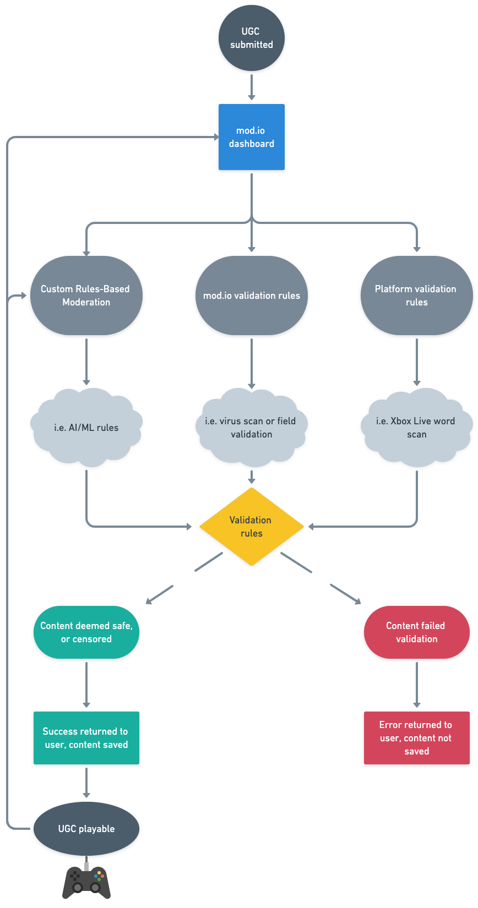

# Automated Scanning

Every UGC submitted to mod.io is first passed through our automated moderation. This consists of mod.io validation rules as well as platform validation rules. If any of the validation checks fail, an API error response will be returned to the user, and they will need to resubmit with the errors corrected.

## Textual content

All text-based content submitted to mod.io is validated through a series of rules, depending on the text field’s settings. It must pass:

1. **mod.io validation** (i.e. correct length, correct type, XSS filter, valid HTML)
2. **Platform validation** (e.g. Xbox Live word filter which blanks words deemed inappropriate)
3. **Custom rules** defined by the Game Admin, using the Rules Engine Moderation system (available to advanced partners only)

## Media and images

All media and images submitted to mod.io are validated via a series of rules, depending on the media’s purpose. All media must pass:

1. **mod.io validation** (i.e. valid image/mime type, filesize, dimensions)
2. **Custom rules** defined by the Game Admin, using the Rules Engine Moderation system (available to advanced partners only)

At the moment, the mod.io system does not apply any AI or ML to detect inappropriate content in images. Studios can use the Rules Engine webhooks feature to incorporate third-party AI tools in their moderation flow.

## UGC files

All files and binaries submitted to mod.io are validated via a series of rules, depending on the file’s purpose. Files must pass:

1. **mod.io validation** (i.e. valid file/mime type, is valid zip file, file size)
2. **mod.io malware scan** (check the file against a continually updated list of heuristics to determine if the file contains viruses, trojans etc)
3. **Custom rules** defined by the Game Admin, using the Rules Engine Moderation system (available to advanced partners only)

### File size validation

At this time only UGC can be submitted to mod.io up to 20gb in size. Small files, under 100mb, will be uploaded in one chunk. Larger files will use a multi-part upload where the file is split up client-side, and re-assembled server-side.

### Malware scanning

The malware scan takes place after file submission. Therefore, if the malware scan fails, the UGC and file will be disabled, the suspected file will be flagged as possibly containing a virus, and a report will be opened for the Game Admin to review.

### mod.io API processes

In addition to the above, the mod.io API will:

* perform a MIME inspection and enforcement of file uploads
* validate the zip file (no zip bombs, correct file table)
* trigger a Lambda function to initiate a scan of the files post-submission
* store audit data for later Game Admin and Site Admin usage
* mark files as a virus, or as safe
* delete files that are marked as a virus by BucketAV

### Lambda function (BigFileScan) and BucketAV

AWS Lambda “Serverless” triggers are used for triggering the BucketAV service when a UGC file is uploaded to the mod.io S3 bucket. BucketAV is used for:

* antivirus scanning using Cisco’s open source ClamAV engine
* reporting of the scan result back to the mod.io API