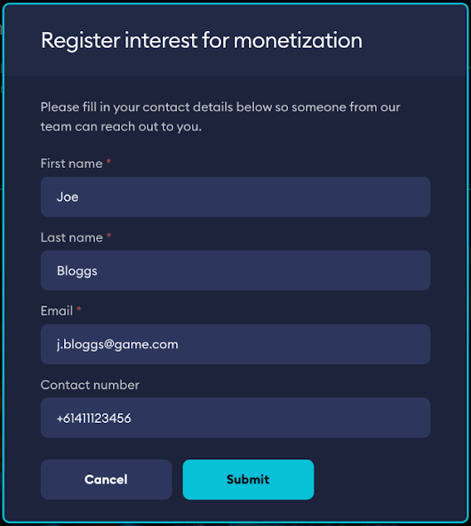
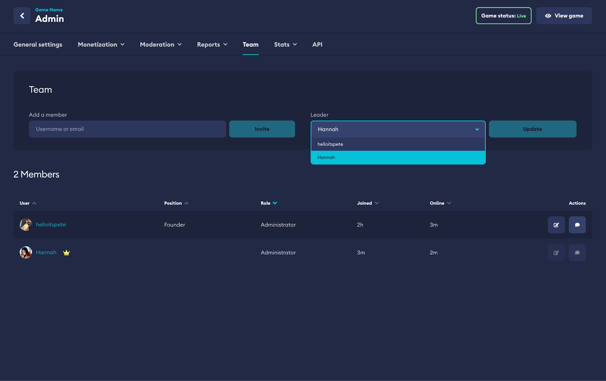

# Enabling Monetization

You can request an introduction to monetization from your game’s dashboard. Our experts will work with you to help set
up and integrate your game and dashboard with the Marketplace functionality.

:::note
Requests go to our support team who will work directly with you every step of the way.
:::

Once enabled by our team, you will be able to onboard, set up and control monetization functionalities through your game
admin dashboard. These settings are only accessible if you are the team leader for your title.

:::tip
Team leader access can be managed through your Team page in your dashboard.
:::