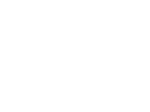

## How It Works

Compatible with all builds of your game on all platforms and stores, mod.io is a clientless and standalone solution which gives you complete control over your modding ecosystem.

## Implementation

Once you have added your game to mod.io and got your [game ID and API key](https://mod.io/library), you can start integrating the mod.io REST API into your game, tools and sites. There are 3 options to get connected which you can use interchangeably depending on your needs. Here's the breakdown of each option.

Option | Usage | Suited for | Docs
---------- | ---------- | ---------- | ---------
__API__ | For connecting directly to the mod.io REST API. | Web apps that need a JSON REST API, or game developers that like a challenge and want control over their implementation. | [Here](https://docs.mod.io)
__SDK__ | Drop our [open source C/C++ SDK](https://github.com/modio/modio-sdk) into your game to call mod.io functionality. | Developers that want a SDK that abstracts the uploading, downloading and unzip flows behind easy to use function calls. | [Here](/sdk/getting-started)
__Tools/Plugins__ | Use tools, plugins and wrappers created by the community to make implementation in various engines easy. | Game developers that want a pre-built modding solution for their engine (Unity, Unreal, GameMaker, Construct) of choice. | Available below

## Official Tools

Plugins and wrappers made or supported by the mod.io team

 | __Unity Plugin__ [SDK](https://github.com/modio/modio-unity) [Getting Started](/unity-plugin) [Sample Project](https://go.mod.io/unity-samples)  |  | __Unreal Plugin__ [SDK](https://github.com/modio/modio-ue) [Getting Started](/ue-plugin/getting-started) [UE4 Sample Project](https://go.mod.io/ue-samples) [UE5 Sample Project](https://go.mod.io/ue5-sample) 
--- | --- | --- | ---
 | __GameMaker__ [SDK](https://github.com/YoYoGames/GMEXT-mod.io) [Getting Started](https://github.com/YoYoGames/GMEXT-mod.io/wiki)  |  | __C/C++ SDK__ [SDK](https://github.com/modio/modio-sdk) [Getting Started](/sdk/getting-started) 
 | __Discord Bot__ [Instructions](https://github.com/modio/modio-discord-bot) [Invite](https://discordbot.mod.io)  | 

## Community Tools

Plugins and wrappers made by our awesome community. Is there a tool out there that should be added to the list? [Get in touch!](mailto:developers@mod.io?subject=Publish Tool)

 | __Construct 2 Plugin__ [SDK](https://github.com/modio/modio-construct2) [Getting Started](https://github.com/modio/modio-construct2)  |  | __Haxe Wrapper__ [SDK](https://github.com/modio/modio-haxe) [Getting Started](https://github.com/Turupawn/modioOpenFLExample#openfl-integration) 
--- | --- | --- | ---
 | __Modio.NET__ [SDK](https://github.com/nickelc/modio.net) [Getting Started](https://github.com/nickelc/modio.net)  |  | __Rust Wrapper__ [SDK](https://crates.io/crates/modio) [Getting Started](https://github.com/nickelc/modio-rs) [Tutorials](https://github.com/nickelc/modio-rs/tree/master/examples) 
 | __Python Wrapper__ [SDK](https://github.com/ClementJ18/mod.io) [Getting Started](https://github.com/ClementJ18/mod.io/#example) [Tutorials](https://github.com/ClementJ18/mod.io/tree/master/examples)  |  | __Common Lisp__ [Github](https://github.com/Shinmera/cl-modio) [Getting Started](https://shinmera.github.io/cl-modio/) 
 | __Command Line Tool__ [CMD](https://github.com/nickelc/modiom) [Getting Started](https://github.com/nickelc/modiom)  |  | __GitHub Action Mod Uploader__ [GitHub](https://github.com/nickelc/upload-to-modio) [Usage](https://github.com/nickelc/upload-to-modio#usage) 

Here is a brief list of the things to know about our API, as explained in more detail in the following sections.

- All requests to the API must be made over HTTPS (TLS).
- All API responses are in `application/json` format.
- Any POST request with a binary payload must supply the `Content-Type: multipart/form-data` header.
- Any non-binary POST, PUT and DELETE requests must supply the `Content-Type: application/x-www-form-urlencoded` header.
- Any non-binary payload can be supplied in JSON format using the `input_json` parameter.
