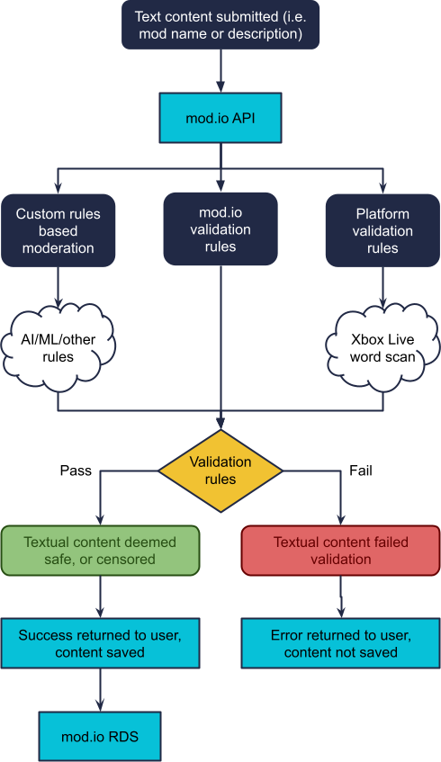
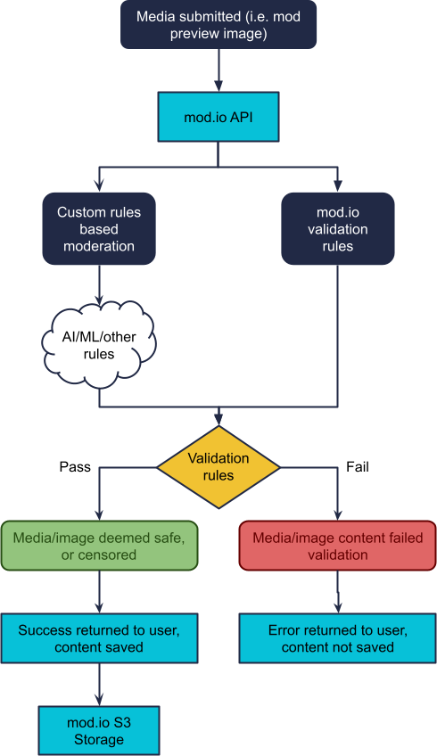
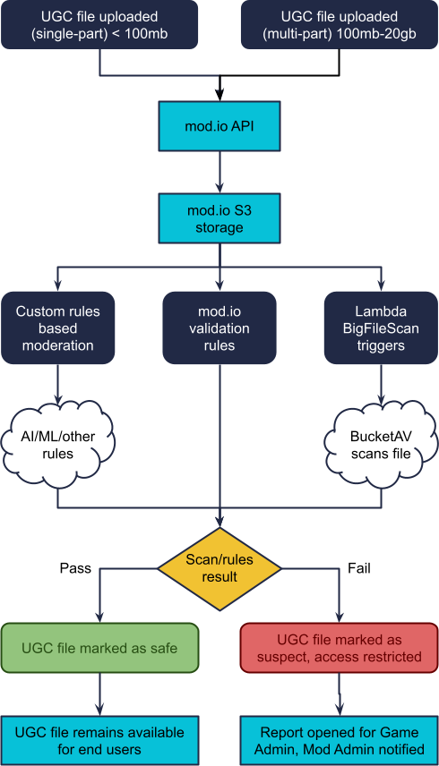
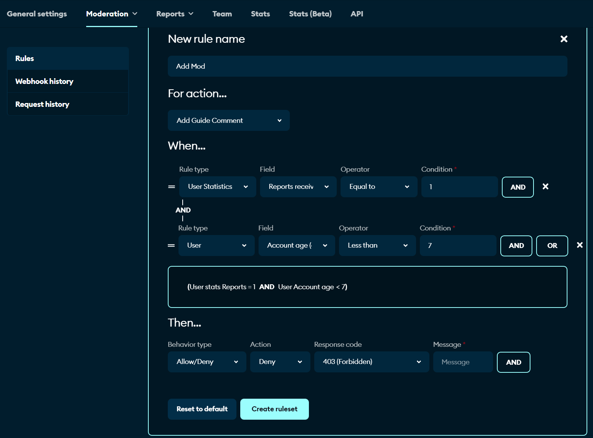

import CrossLink from '@site/src/components/CrossLink'

# How mod.io automates the scanning of UGC content

## Introduction

The purpose of this document is to detail the automated process that all UGC items uploaded to mod.io are scanned by.

The process covers all UGC items including:
* Textual content
* Media / images
* UGC files / binaries

This document does not cover:
* Moderation settings and process available via the games dashboard
* Community reporting and responding process
* Ability to restrict users access
* Flagging content for mature audiences

These systems are explained in the [mod.io Setup and Onboarding Guide](setup-and-onboarding).

## Textual Content

All text-based content submitted to mod.io is validated via a series of rules, depending on the fields settings. It must pass:
1. **mod.io validation** (i.e. correct length, correct type, XSS filter, valid HTML)
1. **Platform validation** (i.e. Xbox Live word filter which blanks words deemed inappropriate)
1. **Custom rules** defined by the Game Admin, using the rules based moderation system (available to advanced partners only)

**On fail:** If any of the validation checks fail, an API error response will be returned to the user, and they will need to resubmit with the errors corrected.

**On success:** The content will be saved, and any moderation settings enabled in the games dashboard by the Game Admin will now take over.

### Text Process

## Media / Images

All media and images submitted to mod.io are validated via a series of rules, depending on the media’s purpose. All media/images must pass:
1. **mod.io validation** (i.e. valid image/mime type, filesize, dimensions)
1. **Custom rules** defined by the Game Admin, using the rules based moderation system (available to advanced partners only)

**On fail:** If any of the validation checks fail, an API error response will be returned to the user, and they will need to resubmit with the errors corrected.

**On success:** The content will be saved, and any moderation settings enabled in the games dashboard by the Game Admin will now take over.

**Note:** At the moment the mod.io system does not apply any AI or ML to detect inappropriate content in images. An enhancement coming to the rules based moderation system will enable studios to turn on such detection, or introduce any moderation tools you utilise.

### Media Process

## UGC Files / Binaries

All files and binaries submitted to mod.io are validated via a series of rules, depending on the file's purpose. Files must pass:
1. **mod.io validation** (i.e. valid file/mime type, is valid zip file, filesize)
1. **mod.io malware scan** check the file against a continually updated list of heuristics to determine if the file contains viruses, trojans etc
1. **Custom rules** defined by the Game Admin, using the rules based moderation system (available to advanced partners only)

**On fail:** If any of the validation checks fail, an API error response will be returned to the user, and they will need to resubmit with the errors corrected.

**On success:** The content will be saved, and any moderation settings enabled in the games dashboard by the Game Admin will now take over.

**Malware scan fail:** If the malware scan fails (since it takes place after submission), the mod and file will be disabled, the suspected file will be indicated it may contain a virus, and a report will be opened in the games dashboard for the Game Admin to review.

**Malware scan success:** If the malware scan succeeds (since it takes place after submission), the file will be marked as passing the malware scan.

At this time only mod files can be submitted to mod.io, up to 20gb in size:
* Small files \<100MB, uploaded in one chunk
* Large files \>100MB, using a “multi-part” upload where the file is split up client side, and re-assembled server-side

### File Process

### Additional Details

The mod.io API from the process diagram above, performs the following functions:
* MIME inspection & enforcement of file uploads
* Validates the zip file (no zip-bombs, correct file table)
* Triggers a Lambda function to initiate a scan of files post-submission
* Stores audit data for later Game Admin / Site Admin usage
* Handles scan results to mark files as a virus, or as safe
* Deletes files that are marked as a virus by BucketAV

If you attempt to re-enable a mod where a primary file is suspected of containing a virus, a warning message will be displayed seeking confirmation. We enable this, as even the best AV/heuristics occasionally report false-positives.

### Lambda Function (BigFileScan)

AWS Lambda “Serverless” triggers are used for:
* Triggering the BucketAV service when a UGC file is uploaded and saved to the mod.io S3 bucket

### BucketAV Service

mod.io utilises BucketAV for the following:
* Antivirus scanning using Cisco’s Open-Source ClamAV engine
* Reporting of scan result back to the mod.io API

## Rules Based Moderation

Rules based moderation is a new feature in development by mod.io (beta expected Q4, 2022, full release in Q1, 2023), to enable Game Admins to add their own arbitrary checks and 3rd party scanning tools to the validation process.

The goal is to combine ML/AI with defined rules, to automate the approval of as much content as possible, without any human intervention, no matter how strict or sensitive your content safety requirements are.

Using a decision-tree based system, you could introduce concepts like:
* If content is submitted by a verified user, automatically approve it
* If content is submitted by a new user, or a user that is submitting a lot of content, flag it for human moderation
* If content contains restricted words, flag it for human moderation
* If content is targeting a console, flag it for human moderation
* If content is suspected of being spam, flag it for human moderation
* On submission, send images to mod.io’s defined AI/ML checks to see if the image contains mature content
* On submission, send text and files to your defined service providers, to see if they pass your checks

An example of how this will look can be seen in the image on the following page.

This feature will be available only to games on an Advanced Plan with mod.io. If you are interested in early access or the technical design document explaining how we intend to implement Rules Based Moderation, please [contact us](mailto:developers@mod.io?subject=Rules%20Based%20Moderation%20details) for the details.

## Changelog

| **Date** | **Changes** |
|----------|-------------|
| 2024, Jan. 30 | Removed Contacts section |
| 2023, Dec. 7 | Document migrated |
| 2022, Aug. 23 | Document created |
