## Mod Hub setup & onboarding guide

## Introduction

mod.io provides studios with the ability to easily, add, configure and customise their games both in-game and for inclusion on our [Mod Hub](https://mod.io/g). We’ve designed mod.io to make UGC an easy, impactful and personalised experience for your players.
  
This set-up guide covers initial set-up of your game, and configuration of your game page on the mod.io Mod Hub. We also support deeper integrations with a fully custom branded mod hub on your own domain name, or support your own single sign-on solution. If you would like to learn more about these advanced features, [get in touch](mailto:developers@mod.io).

This guide will show you how to add your game to mod.io, personalise its appearance, and configure important details such as categories of mods, moderation controls and supported platforms.

### Add your game

Before creating your game, you will need to [log in to mod.io](http://mod.io).
1. Click “Log In” - located at the top right of the page
1. Click your preferred login method (**note:** a customization option we support includes SSO, [reach out](mailto:developers@mod.io?subject=SSO%20support) if you’d like to learn more)
1. Create a username

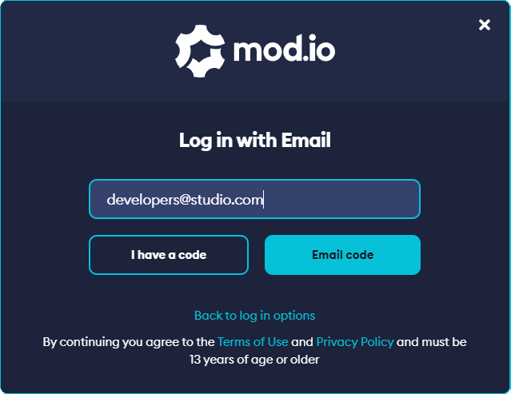

Once you have logged in to mod.io, select “[integrate your game](https://mod.io/g/add/)” from the mod.io home page, or “add game” from the [games page](https://mod.io/g).

### Basic configuration

Before you can add your game to the mod hub, you must configure some basic settings, these are;

| Option | Description | Example |
|--------|-------------|---------|
| **Name** | Enter the name of your game here. This can be changed later, so if you prefer, you can use a codename here. | Awesome Game |
| **Profile URL** | This should closely reflect your game name, but cannot contain any special characters. This will serve as the URL for your mod hub page, and can also be changed at a later point. **Note:** A customization option we support is the ability to provide a branded mod community on the domain of your choice. [Reach out](mailto:developers@mod.io?subject=Branded%20mod%20community) if you’d like to learn more. | `https://mod.io/g/awesomegame` |
| **Summary** | This will appear just below the name on your game page, and can be used to promote the game or user-generated content available. | Discover maps, characters, gameplay modes and more created by the community and ready to play. |

### Game images

We recommended that you set a Header Logo, Icon & Preview Image for your game before you set it to visible / live.

| Asset Name | Description | Example |
|------------|-------------|---------|
| **Header Logo** | This should be your hero logo. We recommend a transparent PNG file format, in a 4:1 aspect ratio, and a minimum size of 400x100 (max size: 256kb) | 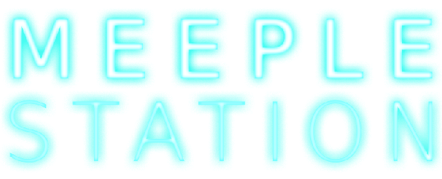 |
| **Icon** | This should be a square image featuring your game’s icon, key art or logo, in a transparent PNG file format - recommended size of 256x256 (max size: 1MB) | 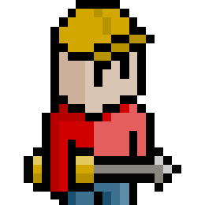 |
| **Preview** | This is your cover image, used on the mod hub directory. We recommend this image features your key art, with logo vertically and centre-aligned, in a 16:9 aspect ratio. Recommended size of 1600x900 (max size: 8MB) | 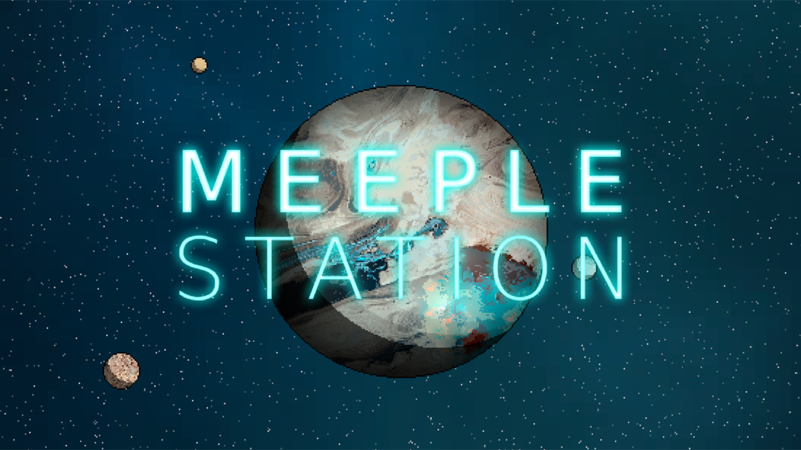 |

### Game colours

You can configure the Primary & Secondary colours of your game page, to match your brand and create a more personalised experience for your community.

We recommend setting **Primary** to a lighter colour, where dark text will be easily visible, and **Dark** to a darker colour where light text will easily be visible. **Light** should be kept as close to default (White or #ffffff) as possible.

We suggest keeping **Success**, **Warning** and **Danger** as their default values, unless they clash with your game’s branding or colour scheme.

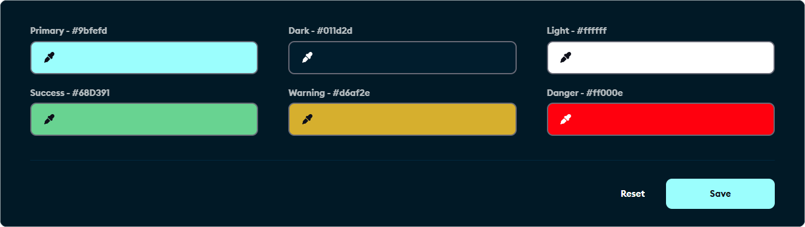

### Content tags

Tag groups help you organise mod content, and are usually selected by the content creator. For players, tags are great for searching, and for game developers tags can be used to control where and how the content works.
  
For example, if your game supported a level editor and a character editor, you might want to have a tag group called "Type," which contains the tags "Level" and "Character" - you could also add other tag groups such as "Level Difficulty" or "Base Character" if you wanted give your community even more detailed and granular filtering options.

**Examples of tag groups:**

| Tag Group | Example Tags |
|-----------|--------------|
| **Type** | Level, Character, Game, Mode, Audio, UI |
| **Difficulty** | Easy, Medium, Hard |
| **Theme** | Fun, Scenic, Realism |
| **Character** | Pyro, Sniper, Soldier|

You can create your first **tag group** in the “tag category name” text box, and then define the tags in the “Tag name” text boxes nested below. You can also see a preview of the navigation menu as it will appear to players on the left-hand side. You can also re-configure the ordering of tags and tag groups to create a logical ordering for your community.

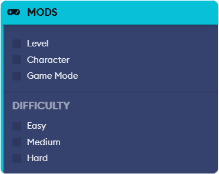

Tag groups also have several configurable options as listed below:

| Option | Description |
|--------|-------------|
| **Multi Selection / Single Selection** | If Multi Selection is chosen, then players can check multiple tags at once to create a more customised experience. If Single Selection is chosen, then players can only browse one tag from the group at one time. |
| **Hidden Tags** | Hidden tags are only visible to game admins, but can be edited by mod creators. An example use-case for Hidden Tags is if you wanted to set up filters for mods such as game version which doesn’t need to be shown to players, but your game client might want to filter on it. |
| **Locked Tags** | Locked tags can only be set by game team members, but remain publicly visible (unless hidden is also checked). An example use-case is to feature mods containing particular tags, without allowing mod creators to feature their mods themselves. |
| **Combining Hidden & Locked Tags** | Often Hidden and Locked Tags are used together so certain tag groups are only shown-to and editable-by game admins. An example use-case would be to flag a mod internally for review, or set special features the tagged mod has the ability to access. |

## Advanced Settings

Once your game has been added, you can configure more advanced settings by navigating to your new game page, then from the **Game Admin** option on the left-hand menu, selecting **settings**.

### Content Management & Policy

Here you are able to configure how your mods / UGC are presented to your players, and set the moderation and curation rules for content in your game.

| Option | Functionality |
|------|------|
| **UGC Name** | This is the name that will be used to refer to the user-generated content in your game. The default is “Mods”, but you may want to use something more appropriate to your game’s UGC offering, such as “Items” or “Levels” - you can define your own custom name by selecting **other**.                            |
| **Mature Content** | Define how mature content will be handled. If the user flags their mod as containing mature content, you can either **disallow** the content entirely, **allow** the content without restriction, or select **mature audiences** only to **restrict** it to users who are 18+, gated with a mature content warning. |
| **Direct Downloads** | If this option is enabled, players can download the mod directly from the mod page and save it to their computer. If disabled, mods can only be downloaded in-game.                                                                                                                                                 |
| **Allow Comments / Allow Guides** | These options disable or enable the ability for players to add comments on mod pages, or contribute content to the guides section of the game page.                                                                                                                                                                 |
| **Autoban** | You can define a **limit** of user-created reports before mod content is automatically removed. Once a mod hits this report threshold, it will automatically be **removed** until it has been reviewed by a member of your team.                                                                                    |
| **Curation** | By default this is set to **No Curation** -mods will appear live right away, and moderation is community driven (based on user reports) - **Full Curation** means all mods will be moved to the pending queue, and must be manually approved by your team before going live.                                        |
| **Submissions** | **Tools only** will disable the ability for users to upload mod content through the mod.io website. **Tools and Website** allows content submission both through your in-game editors / tools, our web-based upload tool, or both.                                                                                  |

### Player Support & Useful Links

Here you can define a contact email address for your support team, or a URL to your support desk, along with other URLs such as your official website, store pages, Discord servers or community hubs.

### Platform Configuration & Moderation

These options are only applicable to games that have enabled mods or UGC on more than one **platform** (such as consoles, VR or mobile) - we recommend you do **not** enable this option if your game is **PC only**.

Once enabled, select the checkboxes for the platforms that will support mods & UGC in your game. In addition, for **PC, Xbox**, **PlayStation** and **Nintendo** platforms, you can enable **Moderator Approval** using the toggle on the right-hand side. If enabled, the content will need to be manually approved by a member of your team before they appear on these platforms.

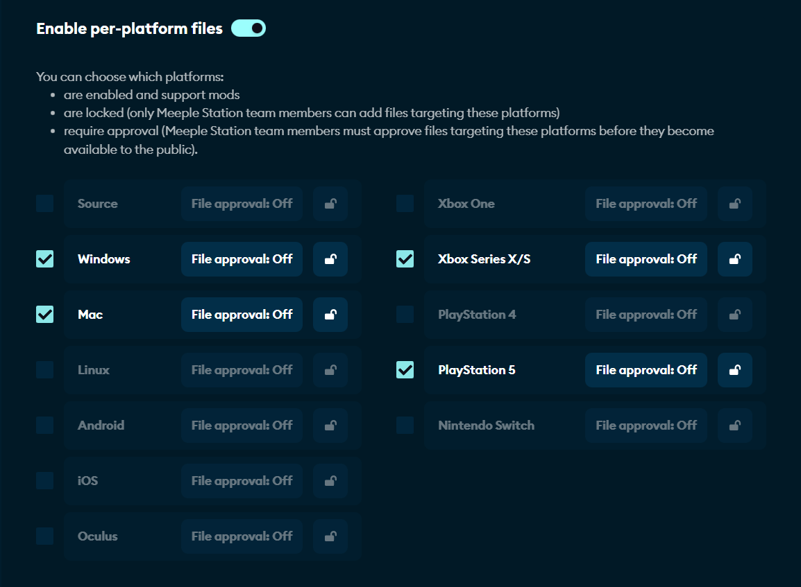

### Authentications

Here you can configure single sign-on within your game for Steam, GOG Galaxy, Nintendo Switch, and Oculus (meta) platforms, using the relevant API key or App ID.
  
If you require assistance configuring these options, please [get in touch](mailto:developers@mod.io) with our team.

## Managing Team Members

You can add an unlimited number of additional users as team members for your game by clicking the **Team** option in the **Game Admin** section of your page. Team members are broken down into three permission levels, **Administrators**, **Managers** and **Moderators**.

| Role | Permission Level |
|-------------------|------------------------------------------------------|
| **Administrator** | Have permission to edit **all aspects** of the game including customization settings, moderation policy, user management, moderation tools, analytics and can view the API Key. |
| **Manager**       | Has access to everything in the **Moderator** role, in addition to being able to view metrics, and the API key.                                                                 |
| **Moderator**     | Has permission to use core moderation tools (add, edit, delete mods, guides and comments), view and manage users, and view and manage the report queues.                        |

### Add & remove team members

Before inviting a new team member to your game, we recommend they create an account using the Email Authentication method on mod.io, following the steps found on **Page 2** of this document.

Once your team member has created their account, enter their email address in the “Add a member” section on the right-hand side, and then click “Invite”

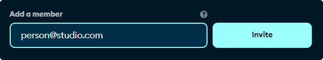

Once you have sent the invite, they will be automatically added to the team at the **Moderator** permission level. Team Members will be displayed in a table below. You can click the **edit button** in the Actions Column to change the permission level of the team member in the **role column**.

You can click the green **save icon** to save the changes, or remove the team member using the red **delete button**.

## Mod Management

You can easily view and manage mod content for your game using the **Mods** option, located in the **Game Admin** section of your game page.

Here you will find a way to easily search, filter and find all mod content added to your game, including mods that are hidden, deleted, or still in draft. Note that hidden, deleted and draft mods will not appear in the mods section of your game page, only in the **Game Admin \> Mods** section.

The mod management page is broken down into four (or five) primary sections depending on your games configuration;

| Section              | Purpose |
|----------------------|---------------------------------------------------|
| **Pending Files**    | This tab will only appear when cross-platform file curation is enabled. Here you can approve individual releases on a per-platform bases, for the platforms you have configured. |
| **Pending Approval** | These mods are being held in a moderation queue, due to moderation rules you have configured. Examples include mods that have hit a predefined threshold for user-generated reports. |
| **Live**             | These mods are currently live and visible on the public site. Any user can discover, subscribe to and download these mods. |
| **Draft**            | The creator has begun to create a mod profile for this mod, but has not yet finalised it, or the mod has not yet been uploaded and submitted. These mods are not visible on the public site. |
| **Deleted**          | Mods which have been deleted either by the mod creator, or by a member of your team. |

The Search tools and filters will only apply or search within the currently selected section.

You are able to review mods that are currently pending approval by clicking the “**review files**” option in the table of mod results.

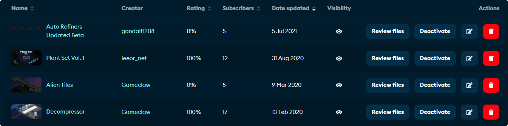

You can also choose to **activate & deactivate the mod** (set it live or hidden), **edit the mod’s details** such as name and description (using the pencil icon) or delete the mod using the red trash can icon.

### Reviewing files

You can quickly download and review any uploaded files for a mod using the **Review Files** option.

Every version of the mod is listed here, in order of most recent to least. You can download that version of the mod to test in your game by clicking the blue link in the **file column**.
  
The **Scan** option (magnifying glass) will perform a virus and malware check on the file. The results are displayed by hovering your mouse cursor over the magnifying glass.
  
You can **edit** advanced details (using the pencil icon) including the **version number**, the **changelog**, and the **metadata blob.** The metadata blob is a useful feature for game developers to include hidden arbitrary data such as the version of the game the mod is compatible with.

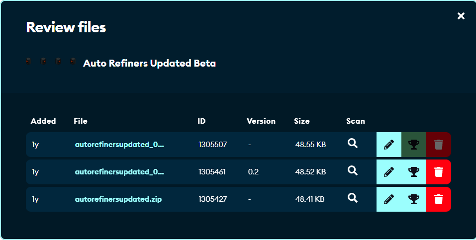

You can also set the file live (using the trophy icon) or delete the mod (using the trash can icon).

### Deleted mods

All deleted mods are moved to the Deleted section, and are no longer visible to any users except team members. Here you are also presented with slightly different options.

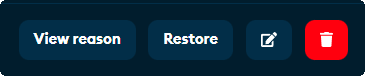

**View reason** will display the date the mod was deleted, the team member (or the mod creator) who deleted the mod, and the reason(s) given by that team member.

**Restore** will return the mod to the **Live** section, and the mod will become visible to all users.

You can also **edit** the mod, in addition to **permanently** deleting the mod by clicking the permanent **delete** button (red trash can icon) - note that once a mod is permanently deleted, _**it cannot be restored!**_

## User Management

Team Members have the ability to restrict and manage the access of users to their game. This might be necessary if a user has repeatedly broken community guidelines, or has violated the terms of service, for example.

### Restricting user access

You’re able to selectively restrict a user from being able to perform the following actions:
* Add a mod
* Add a guide
* Add a comment
* Rate content

Depending on the user’s actions and their severity, you can select one, some, or all of these options to limit their interactions with other users for your game. In extreme cases, users can also be banned entirely - if you require a user to be banned, please [contact us](mailto:support@mod.io).

To restrict a user, visit their **profile page** by clicking their **username** anywhere it is displayed on the mod.io website. Once you are on their profile page, click **Manage permissions**.
  
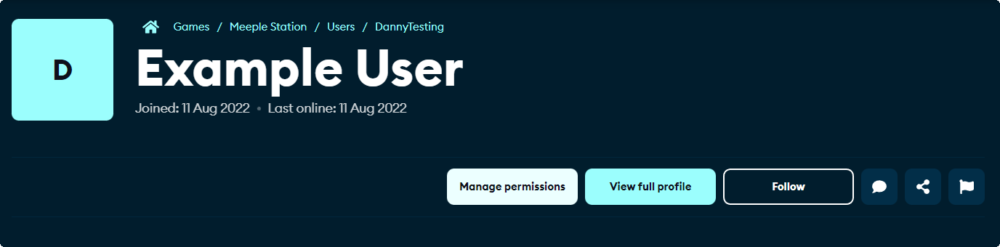

You can then selectively enable or disable permitted functionality using the toggles that appear in the **Manage permissions** pop-up.

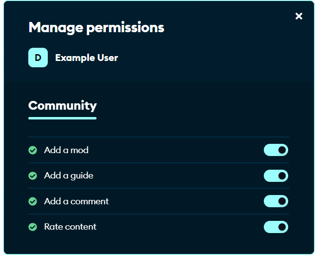

### Managing restricted users

You can view all restricted users for your game in the **users** section of the **game admin** section.

Here you can view the user’s **country of origin**, their **join** and **last online** date, the current **status** of their account (i.e. if they are live, awaiting email approval, or banned) as well as their currently set **restriction level** (fully or partially revoked).

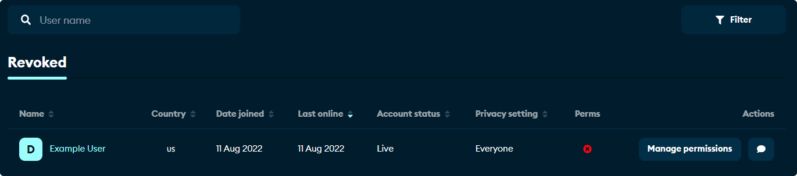

You can also **manage permissions** to alter the current restriction level of that user. Finally, you can also **contact** the user using the speech bubble icon, for example to warn them about their behaviour, or to explain why their account has been restricted.

**Note:** Fully removing a user’s restrictions will remove them from this list.

## Report & Moderation Tools

mod.io provides built-in reporting tools, both through our website and the interface provided as a part of our Unity & Unreal Engine plugins, allowing users to report content that may be broken, contains stolen content, or violates our Terms of Use.
  
Users can report **mods**, **guides**, and individual **users**. Reports for each of these are displayed under **Reports** in the **game admin** section of your game’s page.

### Managing Reports

The process for managing reports is similar across mods, guides and users. The most common type of content to be reported are mods, which will be the focus in this example.

The report queues are split into three sections, **DMCA**, **Other**, and **Resolved**. By default, the **DMCA** queue is displayed, as these are generally the highest priority reports that will require attention.

| Section | Purpose |
|---------|---------|
| **DMCA**     | DMCA, or Digital Millennium Copyright Act reports, are reports that have been filed by a third party copyright holder, alleging that the content is infringing on their intellectual property. These are usually filed by a third party organisation. |
| **Other**    | These reports are less urgent and are generated by community members. Reasons a mod may end up in the other queue include broken mods, rude or offensive content, or anything else that may contravene our Terms of Service. |
| **Resolved** | This is an historical record of reports that have been previously dealt with by a team member, from both the DMCA and Other queues. |

Reports are shown in a table view. Each piece of reported content is shown only once. If multiple users have reported the same piece of content, you will be able to see the number of reports in the **Count** column.

You are able to view more details, including the reasons for the report, and each individual report, by clicking the **View details** button.

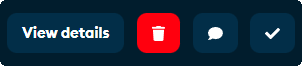

You can also **contact** the mod author by clicking on the **speech bubble** icon. Note that this will open a chat with the **creator of the mod**, and not the person who reported the content.
  
You can mark the issue as **resolved** with **no action needed** by clicking the **check** button.
  
Finally, you can delete the content using the red **trash can** icon. This will remove the mod from the queue, and into the deleted section of the Mods screen.

### Future Functionality

We’re constantly working to strengthen our product offering, onboarding process, dashboards and tools, and have a number of exciting features coming throughout { new Date().getFullYear() }.

The next feature to be released will be rules-based moderation, which will give studios the ability to introduce highly customisable automation rules and granular controls to moderation, reducing the level of manual curation required by your teams.

We will also be introducing an advanced analytics and metrics dashboard, giving studios and publishers access to measure the impact of their UGC success, identify trends, and import data into their own BI solution.

## Changelog

| **Date** | **Changes** |
|----------|-------------|
| 2024, Jan. 30 | Removed Contacts section |
| 2023, Dec. 7 | Document migrated |
| 2022, Sep. 9 | Document created |
