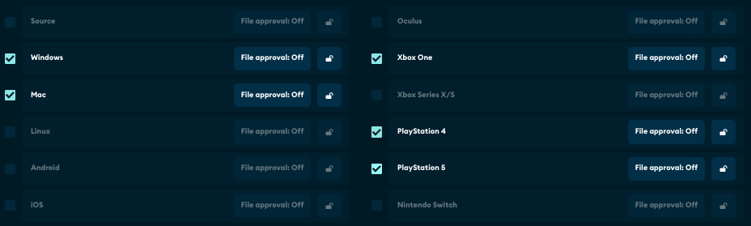

# Launch Your Game

After you’ve integrated [mod.io](https://mod.io/), get your game ready for launch by using the preview feature. While in preview mode, your game is hidden and cannot be seen without permission. 

## Team members

Visit the ‘Team’ page of the Game Admin section to invite team members to help test your integration and moderate UGC. Team members can be assigned roles depending on the permissions you wish to grant.

## Set platform support

If your game uses cross-platform UGC, you will need to set these platforms in the ‘Platform approvals’ tab. This prevents users from uploading UGC for platforms that your game does not support. 

## Share access and test

At the top of your game profile panel you will see your game is in hidden status. Click the ‘Share access’ button to send preview links to team members. This is a great time to test that the content settings you defined when creating the game profile are still appropriate. You may also want to explore the different features of [mod.io](https://mod.io/), and discuss whether you need premium features such as Monetization, Embeddable Hub or Rules Engine Moderation. 

## Launch!

Once you’re satisfied that your UGC integration is ready to be opened to the public, click ‘Publish’ in the Game Admin section. 
