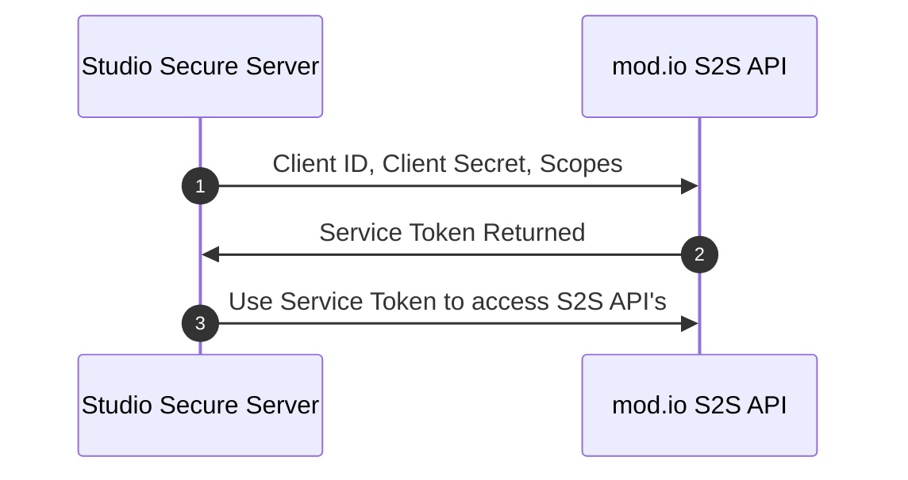
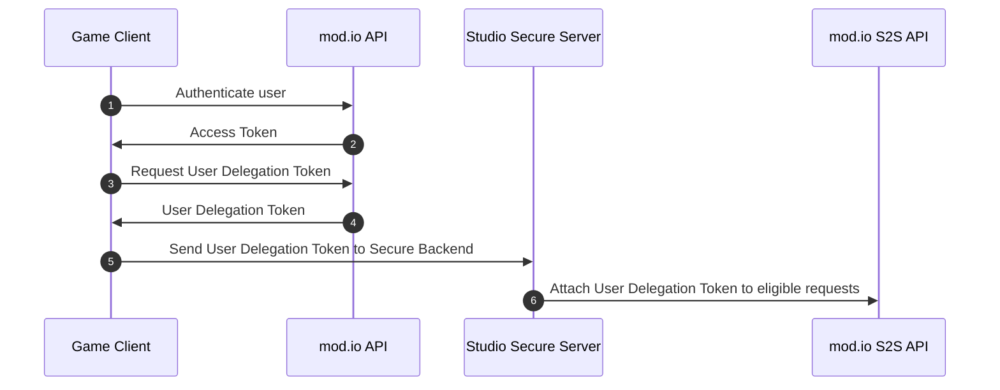

# Overview

To facilitate HTTP requests mod.io's Service To Service (S2S) API's, your backend server must first authenticate and generate credentials that your backend service will use. Credentials required by S2S API's are separate from mod.io's public API endpoints and cannot be used interchangeably.

:::warning[Security Requirement]
All S2S API endpoints defined in this section must only ever be called by a secure backend, and never from a client-side device. By design, the endpoints require credentials such as OAuth Client Secrets which must remain private at all times and should never be shared outside of your secure systems. Failure to follow these guidelines could result in marketplace being disabled for all titles within your organization.
:::

## Glossary

- **Client Credentials**: The OAuth Client ID and secret generated by mod.io to authenticate to mod.io S2S.
- **Service Token**: A token to be used to authentication against S2S API requests, acting as a Bearer token.
- **User Delegation Token**: A short-lived token enabling studios to make S2S API requests on behalf of a user.

## Prerequisites

To authenticate and access mod.io S2S API's, you must have completed the following steps:

- A title registered within mod.io with monetization functionality enabled.
- A secure web backend to make where the S2S API requests can originate from.

## Service Authentication Flow

### Authenticating your secure server



Prior to this flow, you must first create an OAuth Client on your game dashboard, to store on your secure server for Step 1.

1. Studio Secure Server calls mod.io S2S Auth API with the Studio Client ID, Client Secret and requested scopes.
2. mod.io S2S Server responses with a Service token, valid for 90 days.
3. Studio Secure Server attaches Service Token as Bearer token to requests to protected S2S API's.

## Implementation

### Obtaining a service token

When making any requests to service-to-service endpoints, you must always provide a Service Token as the Bearer token in the request. To obtain a service token, you must use the Client ID & Client Secret associated with your game using the standard Client Credentials grant type, which returns a user-agnostic Service Token which can be used for future S2S Requests.

#### Request

`POST https://{your-game-id}.modapi.io/v1/oauth/token`

| Parameter     | Type    | Required | Description                                                                                                  |
| ------------- | ------- | -------- | ------------------------------------------------------------------------------------------------------------ |
| client_id     | integer | true     | Client ID issued to your game.                                                                               |
| client_secret | string  | true     | Client Secret issued to your game. This should be secure on a backend server and never displayed to players. |
| grant_type    | string  | true     | Must be `client_credentials`.                                                                                |
| scope        | string  | false    | The scopes you wish your token to have. Currently only, read, write, and monetization is supported.          |

```
POST https://{your-game-id}.modapi.io/v1/oauth/token
Content-Type: application/x-www-form-urlencoded
Accept: application/json

client_id=12743894323&client_secret=Uq8jI5vWHoX0BBKDFDeaiYOVjofITG19&grant_type=client_credentials&scope=read,write
```
#### Response

```json
{
  "token_type": "Bearer",
  "expires_in": "2592000",
  "access_token": "eyJlbmMiOiJBMTI4Q0JDLUhTMjU2IiwiYWxnIjoiUlNBLU9BRVAiLCJjdHkiOi....",
  "scopes": "read,write"
}
```
##### Response Schema

| Name         | Type   | Description                                                                                                                                       |
| ------------ | ------ | ------------------------------------------------------------------------------------------------------------------------------------------------- |
| token_type   | string | Token type, always `Bearer`.                                                                                                                      |
| expires_in   | int    | Seconds until the supplied `access_token` expires which is fixed at `2592000` seconds (approx 1 month).                                           |
| access_token | string | The service token used to make requests to the mod.io API on behalf of your purchase server. There is no user context associated with this token. |
| scopes       | string | The scopes the of the token that have been set.                                                                                                   |

### Obtaining a User Delegation Token for making requests on behalf of a user

Some service-to-service endpoints require user context to be able to make requests on behalf of a user, such as [creating a transaction](/web-services/iap/studio-as-purchase-server#1-initiating-transaction). To facilitate this, mod.io hosts a public endpoint which can be called by an authenticated user with their bearer token which returns what we call a User Delegation Token. This token should then be sent to your secure backend server from your game client, where you can then use it for specific endpoints in conjunction with a valid service token. See below for the full flow:



1. Game client authenticates the player to mod.io via supported platforms.
2. mod.io returns an access token for the user.
3. Game client uses the access token to request a User Delegation Token.
4. mod.io returns a User Delegation Token.
5. Game client sends User Delegation Token to their secure backend.
6. Secure backend attaches User Delegation Token to eligible endpoints that require it for performing requests on behalf of a user.

#### Request

To request a User Delegation Token to send to your secure backend, you must first use the _Access Token_ from an authenticated user when making the request.

`POST https://{your-game-id}.modapi.io/v1/me/s2s/oauth/token`

```
POST https://{your-game-id}.modapi.io/v1/me/s2s/oauth/token
Accept: application/json
Authorization: Bearer {user-access-token}
```

#### Response

```json
{
    "entity": "purchase_server",
    "token": "eyJ0eXAiOiXKV1QibCJhbLciOiJeiUzI1....."
} 
```

##### Response Schema

Name|Type|Description
---|---|---
entity|string|The entity as to which the delegation token is issued for. Possible Values are `purchase_server`.
token|string|The User Delegation Token to send to your secure backend.

### Authenticating requests with your service token

Now you have a valid service token, your purchase server has the ability to call service-to-service endpoints, such as [Creating Transactions](/web-services/iap/studio-as-purchase-server#1-initiating-transaction), [Relaying Clawback Events](/web-services/iap/studio-as-purchase-server#sending-clawback-data-to-modio) and more.

To authenticate requests using your Service Token, simply add the token to your `Authorization` header as if you would a user Bearer token.

```http
GET https://{your-game-id}.modapi.io/v1/s2s/...
Accept: application/json
Authorization: Bearer {service-token}
```

Your backend service should be configured such as in the event that the service token expires, your implementation can programmatically request another token using your Client ID & Client Secret.

## Recommendations & Best Practices

- An OAuth Client ID, Client Secret and Service Tokens should be kept confidential at all times and never shared with untrusted clients such as game consoles or mobile devices.
- Service Tokens are not associated with any specific user on mod.io, and is a generic token designed to identify your secure server for S2S related tasks.
- Service Tokens are valid for 90 days. We highly recommend caching the token on your backend and only request a new service token if you require different scope(s) or the token has expired.