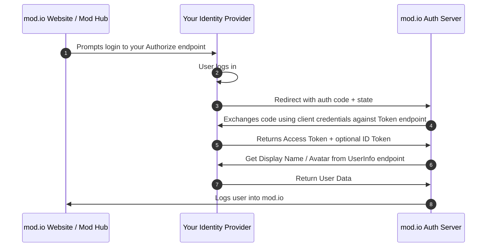

# Overview

If your game studio operates an identity provider that follows the traditional OAuth 2.0 Authorization code flow that is used for websites, you can configure the identity provider to log your players into the mod.io using your OAuth implementation.

Unlike the in-game authentication flow which relies on stateless OpenID tokens, logging into the mod.io website using your identity provider involves mod.io redirecting players to your website to login to your identity provider with their credentials. On success, the player is then redirected back to mod.io to be logged in. See [Authentication Process](#authentication-process) for a detailed explanation of the steps involved.

:::info 
This website-based flow, combined with our in-game OpenID flow are intended to compliment each other to achieve account linking regardless of if your players first interact with mod.io in-game or via our website. If your implementation uses one of these flows, we recommend supporting the other for full account-linking coverage to prevent the possibility of duplicate accounts being created.
:::

## Glossary

- **Client Credentials**: The OAuth Client ID and secret generated by your identity provider for mod.io.
- **Authorize URL**: The registered endpoint that mod.io will redirect users to sign in to your identity provider.
- **Token URL**: The registered endpoint that mod.io will supply a `code` to in exchange for an access token.
- **UserInfo Endpoint URL**: The registered endpoint mod.io will call with a users access token to retrieve account information such as a display name and avatar.
- **Studio Access Token**: An OAuth 2.0 access token, generated by your identity provider for mod.io on behalf of a user, to call your protected APIs.

## Use cases

- **mod.io Website**: Logging users into mod.io using your identity provider credentials.
- **Embeddable Hub**: Logging users into your Embedded Hub using your identity provider credentials. Whilst supported, we strongly recommend your website issuing an OpenID token for the authenticated user on your website, and then sharing the OpenID token with our Embedded Hub.

## Prerequisites

To use our website identity provider login, you must satisfy the following criteria:

- Host an identity provider that implements the [OAuth 2.0 Authorization Code Flow](https://openid.net/specs/openid-connect-core-1_0.html).
- The ability for your identity provider to create an OAuth client for mod.io for `client_credentials` grant type requests.

## Authentication Process



1. A [prompt is displayed](#prompting-users-to-login) on mod.io to sign into your identity provider.
2. mod.io forwards the user to your identity provider login page, as determined by the registered Authorize URL.
3. Upon successful login, your identity provider redirects to the registered redirect URI for the mod.io OAuth Client.
4. mod.io sends the returned code, combined with your registered Client ID + secret to call your identity provider's Token URL endpoint.
5. Your identity provider returns a studio access token and an optional OpenID token for the user.
6. mod.io uses the returned studio access token to fetch the required profile data for a user against the registered User Info URL¹.
7. Your identity provider returns the user display name / avatar (if applicable).
8. The user is logged in and redirected back to the mod.io website.

¹ _If 'Use ID Token for User Profile' is enabled, this step is not required._

## Configuration

### Generating an OAuth Client for mod.io

Prior to configuration on mod.io, your identity provider must create an OAuth client to enable mod.io, using the `client_credentials` grant type to make calls to your OAuth API.

#### Required Redirect URI's

| **Used By** | **Redirect URI** |
|--------------------------|-----------------------------|
| mod.io Website | `https://mod.io/oauth/studio` |
| Embeddable Modhub | `https://embed.modhub.io/oauth/studio`

#### OAuth Client Data for mod.io

Once you have generated the OAuth client with generated with at least one `redirect_uri` shown above configured. mod.io then requires the following fields to be supplied to our dashboard (see below)

- The name of your identity provider
- An icon for your identity provider
- OAuth Client ID
- OAuth Client Secret
- OAuth Scopes
- OAuth Authorize URL Endpoint
- OAuth Token URL Endpoint
- OAuth UserInfo URL Endpoint
- Portal ID Claim (Mapping)

#### Optional fields

- Display name claim (Mapping)

### Setting up your identity provider on the mod.io dashboard

To setup your identity provider follow these steps:

- Go to your game profile on mod.io whilst logged in as a team member
- Click the admin icon in the top-right corner (pencil icon).
- On the left-hand side menu, click 'Studio Authentication'
- Click the **+** button next to _Create new SSO config_

Once the new modal appears, supply the following fields

| **Field** | **Purpose** |
|--------------------------|-----------------------------|
| Icon | The icon of your identity provider / web service that your users will be familiar with. This icon will be displayed when users are prompted to login via your web service |
| Provider Name | The name of your identity provider / web service that your users will be familiar with. This name will be displayed when users are prompted to login via your web service |
| Authorize URL | The URL mod.io will forward a user to upon clicking _Sign in with &#123;your identity provider&#125;_. This field should contain no query parameters as any supplied will deliberately be removed. The page this directs to should be your hosted login page where a user is able to log into your identity provider. | 

<details>
<summary>View HTTP call mod.io makes to the Authorize URL Endpoint</summary>
<p>
```
GET {your-registered-authorize-url-endpoint.com}
    ?client_id={registered-client-id}
    &scope={registered-scopes}
    &redirect_uri=https://mod.io/oauth/studio
    &response_type=code
    &state=c3306a41-b7e4-412f-b78e-7477c79b60b5
```

The state parameter is generated dynamically by mod.io, your system must forward the supplied state back to mod.io on redirect to prevent man-in-the-middle attacks.
</p>
</details>


Once completed, click 'Next'.

| **Field** | **Purpose** |
|--------------------------|-----------------------------|
| Token URL | The endpoint hosted by your identity provider that mod.io will use to exchange the `code` returned from your Authorize URL, along with the supplied Client ID, Client Secret + Scopes |
| User Info | The endpoint hosted by your identity provider that mod.io will use to fetch necessary account data to authenticate the user. |
| Client ID | The Client ID of the OAuth client generated for mod.io | 
| Client Secret | The Client Secret of the OAuth client generated for mod.io | 

<details>
<summary>View HTTP call mod.io makes to the Token URL Endpoint</summary>
<p>
```
POST {your-registered-token-endpoint}
Content-Type: application/x-www-form-urlencoded
User-Agent: ModioSSO/1.0

grant_type=authorization_code
&client_id={registered-client-id}
&client_secret={registered-client-secret}
&redirect_uri=https://mod.io/oauth/studio
&code={authorization-code-returned-on-redirect}
```
</p>
</details>
<details>
<summary>View HTTP call mod.io makes to the User Info URL Endpoint (if applicable)</summary>
<p>
```
GET {your-registered-user-info-endpoint}
User-Agent: ModioSSO/1.0
Authorization: Bearer {access-token-from-token-endpoint}
Accept: application/json
```
</p>
</details>


Once completed, click 'Next'.

| **Field** | **Purpose** |
|--------------------------|-----------------------------|
| Display name claim | _Optional_. The name of the key in your User Info endpoint response that contains the users display name. Leave blank if you do not wish to transfer the users display name but it is recommended. |
| Portal ID Claim | The name of the key in your User Info endpoint response that contains the users _unique user ID_. Note: If you are implementing OpenID authentication, this must be the same value that is returned in the `sub` claim of the ID Token. |
| Scopes | The OAuth scopes mod.io will pass to your Token endpoint when requesting a studio access token. These scopes are associated with your identity provider access tokens and not mod.io. At a minimum, you should supply the scope that allows mod.io to fetch the users profile (i.e. `read_profile`) otherwise authentication requests fail. | 


Once completed, click 'Next'.

A confirmation page will now display a summary of all the endpoints configured and a high-level overview of how the authentication flow will be handled.


Once everything is correct and ready, click 'Create config'.

## Prompting users to login

Once your config has been saved, we are now ready to prompt users to log into mod.io using your configured identity provider. There are two ways in-which users are prompted to login:

- **Manual**: Link to mod.io to your game profile the `?portal=studio` query parameter in the URL. `i.e. https://mod.io/g/my-game?portal=studio`. If a user is directed to this page and already has a linked account with your identity provider, the modal will not be displayed.
- **Automatic**: When a user attempts to do a _write_ action, such as subscribing to a mod, publishing a mod, rating a mod. The prompt will be displayed _if_ the user does not already have their mod.io account linked to your identity provider.


After a successful login against your identity provider and a redirect back to mod.io, the user is then logged into mod.io with a mod.io account, with a 'link' now existing between their base mod.io account and your identity platform.

:::info
mod.io will soon allow the automated functionality listed above only to be triggered via a manual check on the config dashboard above. In the meantime if you wish to not have the user prompted on write actions, you will need to remove your config from your game.
:::

## Unlinking a mod.io account from your identity provider

mod.io users will have the option at any time to remove the link between their mod.io account and your identity provider. A player can remove an account link by doing the following:

1. While logged in, clicking their avatar in the bottom left-hand corner.
2. Click 'General Settings' from the menu that slides out.
3. Click 'Linked Accounts' from the menu on the left-hand side.

The user will then be shown all first party portals, such as Steam, Xbox Live, etc - as well as any connected identity providers by registered games on mod.io.


Once an account link to a identity provider belonging to a game has been unlinked, they cannot be reconnected via this dashboard. Instead, users must then re-link their mod.io account to your identity provide [via the prompt options](#prompting-users-to-login) above.

## Error Reference

| **Error Ref** | **Meaning** |
|--------------------------|-----------------------------|
| 11114 | The OAuth configuration in your games dashboard has not been completed. |
| 11115 | The `state` parameter returned from the Authorize URL endpoint redirect is invalid |
| 11116 | The `access_token` field returned the Token URL endpoint is either missing, or not in the expected data type (string). |
| 11117 | The `expires_in` field returned the Token URL endpoint is either missing or invalid (non-integer). |
| 11118 | The `token_type` field returned the Token URL endpoint is either missing or not the expected value `Bearer` (case-insensitive). |
| 11121 | The expected field from the User Info URL endpoint which maps to the users ID for your identity provider could not be obtained. |